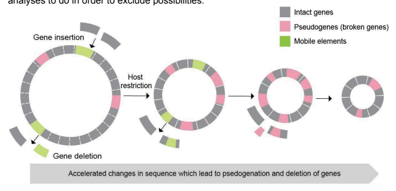
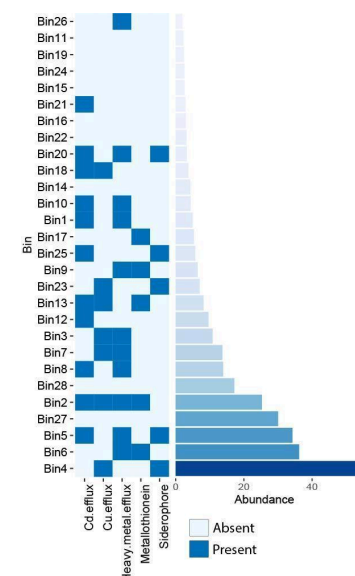
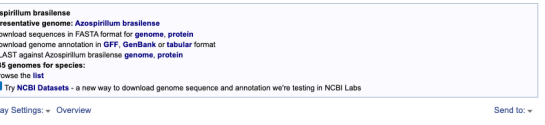
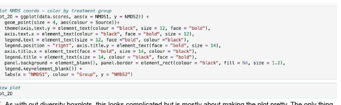
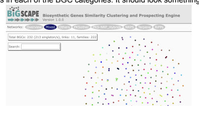

# Tiny Earth Genomics Handbook
by Samantha C. Waterworth, Shane D. Roesemann and Jason C. Kwan

| Table of Contents The Scientific Method                                                                                                                                                                                                                                                                                                                                                                                                                                                                                                                                                                                                                                                                                                                                                                                                                                                                                                 | 5   |
|-----------------------------------------------------------------------------------------------------------------------------------------------------------------------------------------------------------------------------------------------------------------------------------------------------------------------------------------------------------------------------------------------------------------------------------------------------------------------------------------------------------------------------------------------------------------------------------------------------------------------------------------------------------------------------------------------------------------------------------------------------------------------------------------------------------------------------------------------------------------------------------------------------------------------------------------|-----|
| More on scientific hypotheses and how to test them                                                                                                                                                                                                                                                                                                                                                                                                                                                                                                                                                                                                                                                                                                                                                                                                                                                                                      | 6   |
| Reading and writing scientific papers                                                                                                                                                                                                                                                                                                                                                                                                                                                                                                                                                                                                                                                                                                                                                                                                                                                                                                   | 10  |
| Overall structure of a scientific paper …………………………………………………………………...10 The sections of a scientific paper 10 Finding cited papers and others relevant to the subject 15                                                                                                                                                                                                                                                                                                                                                                                                                                                                                                                                                                                                                                                                                                                                                                 |     |
| Documenting your research                                                                                                                                                                                                                                                                                                                                                                                                                                                                                                                                                                                                                                                                                                                                                                                                                                                                                                               | 28  |
| Principles of data visualization…………………………………………………………………… 31 The incredible hidden world of bacterial diversity 35 Why do bacteria make antibiotics? 37 More on the evolved function of small molecules 38 Different data types 41 Unlocking the world of unculturable bacteria 42 Data types worksheet 44 Finding data using public resources 45 Targeted 16S gene sequence 45 Whole genome sequence 48 Targeted metagenomic sequence (aka amplicon sequences) 51 Tracking down a specific set of 16S amplicon sequences 54 Land acknowledgments 56 Setting up a CyVerse account 57 Taxonomic classification of bacteria 59 Using 16S data to identify and count bacteria in a sample 60 Bash Cheat Sheet 62 Analyzing bacterial community structure with 16S amplicons 63 How a 16S rRNA amplicon experiment is carried out 64 1. Experimental steps 64 2. Analytical steps 65 Dummy data dataset 68 Drawing rarefaction curves 70 2 |     |

| Estimating bacterial diversity from amplicon data                          | 71   |
|----------------------------------------------------------------------------|------|
| Plotting bacterial diversity from amplicon data                            | 73   |
| Beta-diversity estimates from amplicon data                                | 75   |
| Plotting NMDS results from amplicon data                                   | 76   |
| Pairwise ANOSIM analysis                                                   | 78   |
| Plotting OTU abundance as stacked barplots                                 | 80   |
| Shotgun metagenomic data analysis                                          | 81   |
| How do we measure bin/MAG quality?                                         | 82   |
| Using CheckM to assess genome completeness and contamination               | 83   |
| Running a CheckM analysis on KBase                                         | 84   |
| Taxonomic classification of genome bins                                    | 88   |
| Identification of a bacterium via autoMLST                                 | 89   |
| Identification of a bacterium via GTDB-Tk                                  | 90   |
| General genome stats                                                       | 94   |
| Specialized functions of bacteria beyond small molecule production         | 95   |
| Annotating a genome                                                        | 99   |
| Types of specialized metabolite                                            | 102  |
| Polyketides                                                                | 102  |
| Peptides                                                                   | 104  |
| Ribosomally-synthesized and post-translationally modified peptides (RiPPs) | 97   |
| Nonribosomal peptide synthetases (NRPSs)                                   | 106  |
| Terpenes                                                                   | 108  |
| And many more!                                                             | 109  |
| Clustering of specialized metabolite genes                                 | 110  |
| Finding biosynthetic gene clusters with antiSMASH                          | 113  |
| Online antiSMASH for a single genome                                       | 113  |
| Stand alone antiSMASH                                                      | 116  |
| Comparing BGCs with BiG-SCAPE and Clinker                                  | 117  |
| Tiny Earth Genomics Report Rubric                                          | 119  |
| Title                                                                      | 120  |
| Abstract                                                                   | 120  |
| Introduction                                                               | 120  |

3

| Results                                                | 120   |
|--------------------------------------------------------|-------|
| Discussion/conclusion                                  | 121   |
| Methods                                                | 121   |
| References                                             | 122   |
| Tiny Earth Genomics Poster Rubric                      | 123   |
| General notes                                          | 123   |
| Graded as a group - poster design and scientific rigor | 123   |
| Graded individually - oral presentation (25 points)    | 124   |

4 The Scientific **Method** The scientific method is a systematic and logical approach to answering questions about observed phenomena.

It is made up of seven steps:
1. Observation: You notice a phenomenon or intriguing pattern 2. Question: Defining what you want to know following the observation 3. Research: You consult the scientific literature to see what is already known about your observation. Sometimes, research will provide the answer to your question. Otherwise, this is an important tool for better understanding the context of your question and will help you make a hypothesis based on known facts.

4. Hypothesis: A statement about what you believe may be happening to produce the observed phenomena/pattern. It is very important that this statement is TESTABLE.

In other words, you can prove or disprove the statement with resources at your disposal.

5. Experimentation: A set of tests that you conduct to determine if your hypothesis is correct/true or not. Normally, only one variable is changed or different (independent variable) and we assess the outcome of that change by assessing a variable (dependent variable) that may be affected by that difference/change.

6. Analysis: Assessing and combining the results of your experiment so that you have an answer to your question and can (dis)prove your hypothesis.

7. Conclusion: A formal summary of the answer you found, in the context of the research you did, and whether your hypothesis was correct or not.

Let's go through each step using an example: Poppy was walking along a path and noticed that

 plants on one side of the path where thriving, while plants on the other side were wilting and dying (Observation). Being a microbiologist, she wondered if the microbes in the soil on either side of the path were different (Question). She went home and found various research articles online saying that bacteria living in the soil can affect plant health and that healthy and diseased plants are often associated with different bacterial communities (Research). Using this information, Poppy thought it was probable that the bacterial communities present in the soil on either side of the path were going to be different (Hypothesis). Poppy gathered three soil samples from each side of the path and performed a metagenomic analysis 16S amplicon sequencing using all 6 six samples to assess the abundance of the different bacteria in each sample** (Experimentation). In this experiment, plant health is our independent variable, and the bacterial populations are the dependent variable. Poppy used the 16S data to produce community profiles for each of her samples and compared those profiles using statistical approaches. Her results showed that the bacterial communities were statistically different (Analysis). Poppy concluded, that like other soil systems she had researched, that the bacterial communities associated with healthy and diseased plants were different and that her hypothesis was correct (Conclusion).

**You'll learn more about this data and how to analyze it soon! More on scientific hypotheses and how to test **them** Scientists use hypotheses to shape what experiments they are going to do and their design. You can think of hypotheses as a sort of (educated) guess of some truth about a system that we don't yet know for sure. The job of a study and individual experiments that go into a study is to determine whether the hypothesis is excluded (i.e. not true) or if it is supported. We concentrate on trying to disprove/exclude a hypothesis because it is often easier to disprove something than prove it beyond doubt. Proving a hypothesis absolutely would involve determining that there was nothing disproving it, but finding just one thing that excludes the hypothesis invalidates it. Mathematics is probably the only field where hypotheses can be proved through rigorous logic alone. But in other fields, even highly mathematical ones such as physics, evidence is needed from experimental observation. So, we therefore have to design experiments and analyses in order to test hypotheses. But, a corollary to this idea is that we have to carefully consider our hypotheses before putting in the work to test it. But what makes a good hypothesis?

## Good Hypotheses Are Testable

One of the features of a good hypothesis is that it is able to be tested. However, it is also the case that a lot of things are testable with a bit of ingenuity, so it is worth thinking very carefully on this point. For example, the question of how far the Earth is from the Sun would be completely untestable to bronze-age people. However, beginning in ancient Greece, it became apparent that this problem was theoretically possible to solve by using simultaneous observations of celestial objects from two locations on Earth, and the use of trigonometry. So, when you are considering a hypothesis, it is very important to work out how you would test it, and also what the result would look like if your hypothesis is correct.

## Good Hypotheses Are Falsifiable

Another feature of a good hypothesis is that it is "falsifiable", or to put it another way, your experiment has the power to tell you if the hypothesis or you are wrong. In the example of ancient Greeks determining the distance of Earth from the Sun - unfortunately at the time their results were not falsifiable because they had no other way of verifying their figures or the assumptions they were based on (i.e., the angles between celestial objects, the distances already measured). In fact, the first estimates of the distance of the Sun were very inaccurate. However, over time humans continued to observe objects in the sky and determined that those original estimates were wrong and refined them. Think very carefully about your proposed experiments or analyses. They might support your hypothesis, but really think about if you got that result, might the hypothesis still be wrong? For example, we can use bioinformatic tool to estimate if a genome is complete after assembly. But many genomes are "reduced" when they exist in a symbiosis and this

 may be reported as "incomplete" but in reality, it's just a small genome with limited capabilities relative to the average genome. From this example you can see that often we can't answer a hypothesis with one experiment/analysis, but we must think of multiple analyses to do in order to exclude possibilities.

Have multiple hypotheses, to keep things interesting. When thinking about hypotheses, it might be useful to write down your thoughts and discuss with your group - often having another perspective is very helpful in figuring this stuff out. I should also note: it is good to have multiple hypotheses! That way, hopefully some of them are both definitely testable and falsifiable, but at the same time it allows room for some more interesting hypotheses that you don't yet know fit the criteria. Exploring difficult questions and finding out if they are testable is half the fun of research. For example, the ancient Greeks likely knew they couldn't verify their estimates of celestial distances, but it was an important question to them and it didn't discourage them from trying. Over the centuries that difficulty led to a lot of innovation in science to tackle it. So - you'll need to judge how solvable a problem is but don't be discouraged from asking big questions! Another point is that you should be open to new hypotheses/questions as they come up from examining the data. You will naturally have additional questions when you examine a large dataset yourself - don't be afraid of exploring these. Because metagenomics involves massive datasets, it is often quite exploratory in nature, and that is OK! Now, let's do an example together. As some people may know, if you add Mentos to soda, the soda will bubble profusely, and it ends up shooting up and out of the soda bottle like a sugar geyser. You can watch several videos on YouTube, and you can see this reaction carried out resulting in a wide variety of spectacular explosions (Observation). Do you 7 think the height of the soda geyser differs with the number of mentos added to the soda? (Question)
1. Online research explained that the Mentos candies have rough surfaces, and this provides areas (nucleation sites) for carbon dioxide present in the soda to cling to and form bubbles. Using this information, what is your hypothesis? __________________________________________________________________ __________________________________________________________________ ____________
2. Define your independent and dependent variables:
__________________________________________________________________
__________________________________________________________________
____________
3. Describe the experiment you would carry out to test this hypothesis:
__________________________________________________________________ __________________________________________________________________ ____________
4. What would you need to keep constant? (Controlled variables)
__________________________________________________________________ __________________________________________________________________ ____________
5. How would you measure your dependent variable?

__________________________________________________________________ __________________________________________________________________ ____________
6. Do you think you should do the experiment more than once? Why?

__________________________________________________________________ __________________________________________________________________ ____________
7. Below are some mock results from the experiment. Using these results, was your hypothesis correct? __________________________________________________________________ ______

Replicate No. of Mentos Height of explosion

(inches)

1 2 12 2 2 13 3 2 11

8

| 1   | 3   | 14   |
|-----|-----|------|
| 2   | 3   | 14   |
| 3   | 3   | 16   |
| 1   | 4   | 17   |
| 2   | 4   | 17.5 |
| 3   | 4   | 19   |
| 1   | 5   | 21   |
| 2   | 5   | 23   |
| 3   | 5   | 22   |

9 Reading and writing scientific **papers** Reading scientific papers is a new skill that can take some time, patience and practice to develop. The bottom line is that after you become familiar with the layout that they tend to use, you don't necessarily have to read every part and understand every word to get out the information you need. Below is a general guide on how to go through a scientific paper. Note: Consideration of this subject will also be useful to you when you come to write your own scientific paper later in the course. Overall structure of a scientific **paper**

 An original research article typically follows a general "hourglass"-shape in terms of specificity. The introduction should introduce large, general ideas and the motivations for the experiment and narrow itself to the main hypothesis and a one sentence summary of the experiment. The Results and Methods sections are the most narrow in scope and therefore should be very detailed. The Conclusion section is the inverse of the introduction where it restates the hypothesis, the main findings, and finishes with broader implications of the research or state of the field. The contents of each section are detailed below. The sections of a scientific **paper** The exact organization of a paper will depend on the journal's requirements, and also the article type. A particular journal might accept various article types, but common ones include review articles (summaries of other literature), full research articles (original research, long-form), brief research articles (original research, shorter-form). Review articles are more like book chapters that summarize a subject, but with more complete citations in many cases. They do not describe original research, generally, and so will not be considered further here. Original research articles will generally include several standard headings. Below I outline what you will find under each section.

## 1. Title

As in other aspects of life, some writers are very good at coming up with good titles, others less so. In scientific papers, then, the title will hopefully be informative, but it could also be very vague or excessively long and technical. Sometimes the title includes the main conclusion of the work, which is useful.

## 2. Abstract

The abstract is a short paragraph, usually ~200 words, which summarizes the work, including what was done, the main conclusions, and (sometimes) why the result is significant. Sometimes there is a separate "significance" section which puts the work in context in the field. In terms of the hourglass analogy, the abstract section is a summary of the full article. It should encompass the entire hourglass: start with the main broad idea, state the hypothesis, state major steps taken, make conclusions, and finish with optional significance. An additional note: some researchers only look at the abstract and figures in a way to "speed-read" articles. Be sure to formulate your abstract with this in mind.

## 3. Introduction

The article will start with an introduction, which gives some background of the subject under study. Sometimes the introduction will also go into the motivations the researchers had for the study and why they came up with their research questions. Typically, the introduction ends with a short summary of what was done and what the results were. In published papers you don't often see the explicit words, "our hypotheses were ...." and "our hypotheses were supported/not supported", but very often a hypothesis is stated in the introduction more implicitly in the form of "we believe …". You should aim to include hypotheses in your introduction.

## 4. Materials And Methods

The materials and methods section, sometimes just "methods", gives details on how each of the experiments and analyses in the manuscript were carried out. The idea is that there should be enough information for a reader to repeat the analysis if they want. However, authors and reviewers are human and so sometimes they leave some detail out that is not obvious to the reader. There is also often a pressure from the journal to not make articles too long, and so authors sometimes avoid repeating details from other papers, and may say something like, "PCR experiments were carried out as described in Smith et al.

11
(1983)", in other words they will cite some other paper with the full method. Or that is the idea. What sometimes happens is there is a long chain of citations going back in time through dozens of papers. When you write your own methods sections, aim for clarity and not to leave details out. One important thing to note is that the methods section is narrowly focused on how things were done, and not the results of experiments. Another thing to be aware of is that the methods section might include blanket descriptions on how PCR reactions were carried out, for instance, but it won't go into all the times that PCR was used and why - that information is generally described in the Results section.

## 12 5. Results

In the results section, there will be a description of what experiments were carried out (if you want to know all the details of how they were carried out, see the Materials and Methods section), and what data was observed (i.e., the results). There might be mention of the immediate inferences that can be made from these results, but a more in-depth discussion will be made in the "Discussion" section. For bioinformatics or computational papers, different analyses will be discussed much like wet-lab experiments would, along with their results.

Note: Sometimes Results and Discussion are combined into one section.

6. Discussion In the discussion section, authors generally bring together all the data from all the experiments outlined in the results section and make conclusions about the system as a whole based on them. The first sentence or so can be used to restate the purpose of the study and the hypothesis. Authors will also use the discussion section to compare their current findings with previously reported data in the literature. Sometimes this is useful because old data is put into a new light due to the work described in the manuscript. The discussion section is also sometimes used to outline the limitations of the work being described (in terms of what conclusions can be made) and what types of future studies and experiments would be useful in light of the paper's findings. Note: Sometimes Results and Discussion are combined into one section.

## 7. Conclusion

Sometimes a short conclusion section is included, which summarizes the overall conclusions of the study and its implications. However, if not explicitly present, the last paragraph of the discussion section usually serves this purpose.

## 8. References

In a scientific paper, each declarative statement must be backed up either by previous work in the literature or by work described in the current paper. So, throughout the manuscript there will be citations to specific papers, which are listed in the references section. You will sometimes find it useful to look up these references, which are usually other journal articles, to find more details on a subject being discussed or to find additional experimental details.

Caution: Plagiarism is a very, very serious offense. You cannot copy anyone's work verbatim. Nor can you just substitute in a synonym or two and call it good. You have to read the work and summarize the salient point(s) in your own words. You then cite the original article where you got that point from in your report/poster. There are many useful software choices to manage your references (such as Mendeley, Paperpile, etc) that can store your article PDFs in one location, interact with your Word document directly, and generate your reference section automatically.

9. Supporting information These days, a lot of authors submit lots of data and extra analyses in what is known as the "supporting information" section of the paper, typically only available through the internet and not included in the paper journal or the standard PDF of the article. This section is particularly used in metagenomics papers because the data are so vast. So, you will often find it useful to look through the supporting information for details of the dataset being examined. One thing to note is that often the supporting information contains extra details that would normally be in the Materials and Methods section. So, if you think something is missing from the methods, first look in the supporting information. Before you begin: What is your objective? But, before we even start going through a paper, you need to ask yourself what information you need to get out of it. A researcher will approach a paper in an entirely different way depending on what they want to figure out. Below are some common objectives and corresponding reading approaches a researcher might take.

- I want to know whether this is worth reading. - I want to understand what the authors did and what they concluded. - I want to work out how they did a particular task/analysis. - This paper looks interesting, but I first want to get some background on the subject. - I want to know if anyone examined the remaining questions left after this paper. - I would like to compare what I found to what other people found (contextualization of results).
Let's go through some strategies for each of these in turn: I want to know whether this is worth reading The best thing to do here is to perhaps first go through the title and abstract, and it is also worth going through the introduction for extra context. That should tell you if the paper is interesting and/or covers what you are looking for. I want to understand what the authors did and what they concluded The easiest way in this case is to go through the abstract and introduction, and then when you have a bit of context as to what was done, have a look at the figures each in turn and go through their captions in detail. Try to understand what the figures are telling you and how they relate to each other. If the figures are not entirely clear, go over the captions - they should include details that help you to interpret the figures without reading the text. If you still don't quite fully understand the figures, that is OK - you can now go through the results and discussion in detail with the aim of working out what the figures are showing. You will also pick up extra details along the way. Pay special attention to whether you think the evidence presented adequately supports the conclusions the authors are making. A scientist will usually read a paper with a somewhat skeptical attitude because mistakes can happen and if the paper is a few years old the authors would not have had all the information we have now.

Note: You can (in most cases) skip the methods unless you are interested in specific details of how the authors did something or you want to make sure it was done properly.

I want to work out how they did a particular task/analysis This sort of situation arises fairly frequently, for example when you see a paper does something that you think could be applied to your own work. You might want to lightly scan the results first to determine that they did what you want to do, and then the thing to do is to go through the methods section very carefully. If you initially don't find what you are looking for, then often extra details of the methods are included in the supporting information. At the end of the day, though, authors are human and sometimes can omit details that seemed obvious at the time or just because of an oversight. So, you could also contact the corresponding author indicated on the first page of the paper.

Caution: While most authors are very willing to answer questions, most are also very busy. First make absolutely sure that the answer is not in the paper (if it is, asking would be wasting the author's time). You might want to ask someone else what they think.

Secondly, in your enquiry be sure to write clearly, specifically, and briefly.

This paper looks interesting, but I first want to get some background on the subject You may feel this way when you try to read the paper but keep getting the feeling that you are out of your depth with the subject in general. Perhaps the easiest approach would be to go through the introduction again and make a note of any citations the authors make. Work out from the context of the sentences that cite specific papers, which citations are likely to be good primers on the subject and try to look up the cited papers through the library. A review article would be the best option in most cases, but sometimes primary research articles cited might themselves cite good review articles in their introduction. If you don't find anything relevant, then you also might want to look at the discussion section of the paper, especially if it tries to put the paper's findings in context of previous findings - there might be good citations in this section you can look up. Another good fallback option is to try to find background review articles yourself through databases such as SciFinder, but this might take more time as your search is likely to turn up a lot of hits to go through and evaluate. Note: I explain below how to find papers through the UW-Madison library. I want to know if anyone examined the remaining questions left after this paper The easiest way to figure this out is to copy the title of the paper and paste it into Google. You will generally find a result for the paper, but somewhere under the main title of the page will be an indication of how many other papers cited the one you searched for. It will say something like "cited by 144". That text is a link that will take you to a Google Scholar page which lists all the papers that cited your paper. Now, the thing to remember here is that papers are cited for a lot of reasons. Your paper might be cited by a review article, which puts it into context with other works - this might be useful in answering your question. But also, your paper may be cited by other primary research articles that go into the questions raised in your paper in more detail. So, the approach to take is to first go through the Google Scholar results and narrow down which entries seem like they might contain answers from the titles and the small snippet of the abstract that is shown. Each entry is a link that you can click and see the full abstract.

I would like to compare what I found to what other people found (contextualization of results) If you are repeating the analyses from another paper and would like to compare results, probably the approach under "I want to understand what the authors did and what they concluded" would work well, although it might be worth going into more detail in the methods, especially if you get different results. If that happens, pay attention to the details of what the authors did and how they presented their data - are you using the same method to visualize your results? If your results agree, then that at least indicates that you probably carried out the procedure correctly. Finding cited papers and others relevant to the **subject** The approach you take in finding papers depends on whether you know the citation of a particular paper you want, or you want to search in a more general way.

## Finding Papers By Citation

Many journal publishers are for-profit entities that require payment or subscription in order to access articles, but more and more are moving to an open-source model where the publishing authors pay a fee when their paper is accepted, and it is offered free to the public. Probably the easiest first step in trying to look up a paper you want is to go to PubMed and paste the title in the search bar. There will usually be an entry in PubMed for the paper you are looking for, and there will be links to the full text. Often the paper will be free, but sometimes it will not be. Luckily, UW-Madison has subscriptions to most paid journals. You can go to the library website and first search for the journal name in the catalog. For some reason there are sometimes multiple entries for a journal and other items you have to go through - but what you are looking for is the entry for the journal that contains special links to online access. The link from the library is special and allows you to access articles through the university's paid subscriptions. When you have clicked through to the link, you can use the journal's website to find your specific paper. If you have the year, volume and page numbers of your article, the easiest way to get it is often to use the "advanced search" feature, and put those numbers in. Another alternative is to go to the "archive" section (or sometimes this is called something like "all issues"), and find the issue that contains your article, then you can find the article in the table of contents. Searching for papers in a general way You can actually find papers pretty effectively with just Google, but it might be slightly better to use Google Scholar. You can search for the subject you want to search for but depending on how many hits you get it might be better to try to be as specific as possible. One useful feature is that you can limit the hits to time periods - for example just papers published in the last year. And for each, you should be able to see which papers cited it. You can also use specialized scientific literature databases. One that we like is called SciFinder. Unfortunately, it has a paid subscription, but you can access it through this library page. You must register with SciFinder through that library page, and then you should be able to use it. One useful feature of SciFinder is that you can search by molecule (for example, an antibiotic you are interested in). You can also filter according to paper language, publication type (i.e. journal article, book, patent), author and more.

See the following pages for an example of a scientific write up that would be expected at the end of this course. Note: bullet points in *italics* are notes on the different sections, and would not appear in a real manuscript. Another tip: You may find the methods section in the example paper below hard to understand at this point. That is OK! Later in the course, hopefully you will be able to look back over it and understand much more. For now, you can refer to the "I want to understand what the authors did and what they concluded" section above to see that you don't need to have a detailed understanding of the Methods in order to get a broad overview of what was done and what was concluded. An exception is you may find some acronyms defined upon first use within the Methods section.

Heavy metal contaminated soils are dominated by *Cupriavidus* bacteria with multiple potential heavy metal resistance mechanisms Author name (that's you) Title and **authorship**
- Must accurately describe and encompass the research you *performed.*
- Ideally, it should include your overall *finding*
- If you can come up with something clever, that's great, but don't sacrifice clarity for it.

- List all authors involved in the project. Normally their listed in order of who **contributed**
the most work to the least, although this varies by field and equal authorship can be indicated with *footnotes.*
Abstract
- A short summary of the entire project. Try to summarize each section into a **sentence**
or two and then compile all into a nice, flowing paragraph that gives the *reader* an overview of what they're about to *read.*
- End with your aims and the objectives whereby you intend to accomplish these *aims.*
A previous study determined that bacteria in soil heavily contaminated with toxic metals carried genes that conferred resistance to this pollution. We aimed to determine which bacterial populations thrived in this polluted environment and whether metallothionein genes were present in these bacteria. Using amplicon analysis, we found that populations of *Cupriavidus* bacteria were most dominant at moderate concentrations of heavy metals, but that this population gave way to Stenotrophomonas bacteria which dominated the soil community at high levels of metal contamination. Assessment of genome bins from shotgun metagenomic data showed that most bacteria at moderate concentrations of heavy metal pollution had multiple potential means of metal resistance, which included various efflux pumps, metallothionein and siderophores for metal uptake, degradation and expulsion. Bin 4, which was classified as Cupriavidus *necato,* was the most abundant, and included at least three means of resistance, but did not carry metallothionein genes, which suggested that several resistance systems can be deployed to thrive in contaminated environments. Introduction
- A brief overview of information pertaining to your study that allows the reader to **grasp** a fundamental understanding of the aspects involved in the *study.*
- If possible, this should outline a problem or gap in our knowledge, what is currently **known**
and then how your research aims to address this problem or *gap.*
- It should flow in a logical manner, with each aspect leading to the *next.*
- Use paragraphs! The "enter" key is your friend. Separation of concepts with **paragraphs**
helps indicate a change in topic and makes the paper easier to *read.*
Human exposure to heavy metals has increased rapidly in recent decades, primarily due to the use of fertilizers, pesticides, chemical manufacturing, tanning, and other anthropogenic activities1.

Recent studies have shown that human exposure to soils contaminated with heavy metals can lead to various illnesses, such as cancers, ulcers, central nervous system disorders and several other serious maladies2. Therefore, investigation of methods for remediation and bioremediation are vital for the removal or degradation of these metals in soils. Current methods of remediation include physical remediation, chemical remediation and biological remediation. Physical remediation largely comprises of the replacement of contaminated soil or thermal desorption3,4. Chemical remediation includes several diverse possibilities, including leaching, fixation, vitrification, and electrokinetic remediation3,4. Finally, biological remediation involves the use of microorganisms to take up or modify heavy metals through enzymatic reactions3,4. A previous study conducted by Li and colleagues5found that soils that are contaminated with moderate to high levels of copper and cadmium are host to bacteria that carry several types of metallothionein genes. Expression of these genes resulted in the sorption of heavy metals from the soils, and subsequent accumulation in the bacteria cells. These genes and other genes used by bacteria for metal resistance may be exploited for the bioremediation of contaminated soils. During the original study by Li and colleagues, they used amplicon sequence analysis to assess bacterial community profiles across soil samples that they treated with various concentrations of copper. In this study, we aim to determine which bacteria are most abundant in contaminated soils and assess whether these bins carry metallothionein genes, by reanalyzing the data from Li and colleagues. These results could be used to develop new bioremediation tools.

## Methods And Materials

- A detailed account of the steps you *took*
- Separate sections for separate *experiments/analyses*
- Use *subheadings*
- Don't forget to cite bioinformatic tools or *packages*

## Data Acquisition

Both 16S amplicon data and metagenomic data were taken from Li et al.5 and analyzed by TEG
staff. 16S amplicon data from soils treated with varying levels of copper were analyzed using Mothur6, clustered into operational taxonomic units (OTUs) and provided in the form of count tables, taxonomy tables and associated OTU consensus sequence fasta files. Operational taxonomic units (OTUs) are groups of amplicon sequences that share a threshold level of sequence similarity. Our sequences are gathered into groups at a distance of 0.03 which means they share 97% similarity. A sequence similarity of 97% in 16S sequences is an approximation to gathering bacterial species into groups. Metagenomic data was assembled using SPAdes7 and binned using Autometa8. Metagenomic bins were provided by the TEG staff.

## Amplicon Analysis

Amplicon data is the amplification of a single gene or section of a gene, such as the 16S gene in bacteria. These amplicons can then be grouped according to similarity into operational taxonomic units (OTUs). When grouped at a similarity of 97% (equal to a distance of 3%), 16S OTUs are an approximation to bacterial species present. 16S amplicon OTU counts were converted to relative abundance and community profiles visualized using R
9 using the ggplot package10. Comparison of bacterial communities across the different metal concentrations was performed using NMDS and ANOSIM analyses in R
9 using the vegan package11.

Metagenomic bins were classified against the GTDB database using GTDB-Tk12. The quality of bins was assessed using CheckM13 and general statistics (e.g. genome size, GC content) were found using in house Python scripts. Genes in each bin were identified using Prokka14 and annotated against the NCBI nr database using DIAMOND15 and against the KEGG database using KOfamSCan16. Ribosomal RNA sequences were extracted from bins with barrnap17. Biosynthetic gene clusters were identified using antiSMASH18in relaxed mode with all options enabled. Comparative BGC visualizations were generated in Clinker19 using antiSMASH output files.

Results
- Introduce each section with a very brief summary of what was *done*
- A description of what you found from your *analyses*
- Figure legends: Annotate the figure so someone could understand the basics of what you did and how to interpret the *figure.*
- Figure legends go below the figure, table titles go above the *table.*
- You can separate your results with subheadings like you did for the Methods *section*

## Amplicon Analysis

Bacterial community profiles of soils treated with different concentrations of copper (0, 1000mg/Kg, 2000mg/Kg, 4000mg/Kg and 8000mg/Kg) were compared using non-metric multidimensional scaling (NMDS) and ANOSIM analyses. The bacterial communities of samples treated with 8000mg/Kg of copper were very distinct and clustered away from all other samples, while communities present in soils treated with 1000mg/Kg and 2000mg/Kg appeared to cluster more closely (Fig. 1).

Figure 1. Non-metric multidimensional scaling (NMDS) of OTU relative abundance of bacterial communities from soils treated with different concentrations of copper show distinct clustering. A colored key is provided to indicate samples treated with different concentrations of copper. However, it was found through ANOSIM analysis that bacterial communities from all treatments were significantly different from one another (Table 1).

| Table 1. ANOSIM analysis results Sample A Sample B   | P value*       | R statistic   |      |
|------------------------------------------------------|----------------|---------------|------|
| No Cu stress                                         | 1000 Cu stress | 0.002         | 0.98 |
| No Cu stress                                         | 2000 Cu stress | 0.002         | 1    |
| No Cu stress                                         | 4000 Cu stress | 0.006         | 1    |
| No Cu stress                                         | 8000 Cu stress | 0.004         | 1    |
| 1000 Cu stress                                       | 2000 Cu stress | 0.04          | 0.7  |
| 1000 Cu stress                                       | 4000 Cu stress | 0.02          | 0.85 |
| 1000 Cu stress                                       | 8000 Cu stress | 0.005         | 1    |
| 2000 Cu stress                                       | 4000 Cu stress | 0.03          | 0.8  |
| 2000 Cu stress                                       | 8000 Cu stress | 0.008         | 1    |
| 4000 Cu stress                                       | 8000 Cu stress | 0.007         | 1    |
| *Significant difference defined as p < 0.05          |                |               |      |

We then assessed which bacteria were most dominant in each soil treatment and found that OTUs 1 and 2, which were classified as *Cupriavidus* and an unclassified Oxalobacteraceae respectively, dominated soil communities at concentrations of 1000-4000 mg/Kg. These populations then appear to decrease at higher copper levels and OTU3, which was classified as *Stenotrophomonas*, was most dominant when soils were treated with 8000mg/Kg copper (Fig. 2).

We were provided with 28 genomic bins derived from soil treated with 4000mg/Kg copper. There were 4 high quality bins, 10 medium quality bins and 14 low quality bins (Table S1). The most abundant bin (Bin 4) was classified as Cupriavidus *necato*. This is thus in agreement with the amplicon analysis were the most abundant OTU in the soil treated with 4000mg/Kg copper was classified within the *Cupriavidus* genus. The 16S rRNA sequence extracted from this bin shared 99.5% sequence similarity with OTU1 and thus was considered the genomic representative of this OTU. The C. *necato* bin encoded at least 10 biosynthetic gene clusters (BGCs), one of which was most similar to the BGC found in other C. *necato* strains that encodes the cupriachelin siderophore (Fig. 3).

Interrogation of KEGG annotations revealed the presence of several genes predicted to encode enzymes involved in metal uptake across many of the genome bins. Metallothionein genes were detected in only 5 of the 28 genome bins, which did not include the most abundant C. necato bin (Bin4). Assessment of the presence of various genes involved in metal resistance against bin abundance showed no clear trend and it appeared that different bacteria use different mechanisms to survive in metal polluted soils (Fig. 4).

Figure 4. There is no correlation between the presence of certain genes that are predicted to aid in metal resistance, and genome abundance. A key is provided to indicate presence or absence of each gene in Discussion
- This is your opportunity to contextualize your results with current literature. What did you see and why? Was it the expected result? If not, what could have been the cause? It's not always a mistake - sometimes you can stumble on something unexpected but *great.*
- When justifying a result ALWAYS back it up with *literature!*
- Tell a story!! The discussion should flow in a logical order with each result leading to the result of the subsequent experiment. Just because you did the experiments in a *particular* order does not mean you have report them in that *order.*
- Start your discussion with your aims and end your discussion by neatly tying up **each**
accomplished aim at the end (i.e. a concluding paragraph). Additionally, one could **include** further studies that may bring even greater insight into answering the research *question.*
During this study we aimed to determine if genes encoding metallothionein enzymes were present in bacteria that are most abundant in metal contaminated soils. Using data collected during the study by Li and colleagues, we found that bacteria classified as *Cupriavidus* were the most abundant at moderate levels of metal pollution (1000 - 4000 mg/Kg) but that these populations gave way to *Stenotrophomonas* bacteria at high levels of metal contamination (8000 mg/Kg), which was in agreement with previous findings. *Stenotrophomonas* bacteria have been found in abundance in other regions with heavy metal contaminated soils20,21, and they have been previously investigated for their potential as bioremediation agents with encouraging results22,23. Similarly, populations of *Cupriavidus* bacteria were found to increase with increasing levels of heavy metal pollution in other studies24,25.

We extracted a total of 10 bins from sequence data acquired from the 4000mg/Kg sample, where Cupriavidus bacteria were predicted to be most dominant. Assessment of this bin revealed the presence of a siderophore BGC most similar to cupriachelin. Siderophores are small enzymes that bind strongly to iron and help bacteria with iron acquisition26. However some siderophores can bind other metals and can aid in detoxification as the siderophore remains bound to the metal without shuttling it into the bacterial cell to effectively prevent the detrimental effect of heavy metals26. As the expression of siderophores had previously been found to help *Stenotrophomonas* bacteria survive in metal contaminated soils22 we hypothesized that the same may be true for Cupriavidus bacteria. Following this, we investigated whether certain genetic traits were associated with the bacteria that thrived and were abundant in metal-polluted soils. With reference to genes associated with heavy-metal resistance (efflux pumps, metallothioneins, and siderophores) we found that the most abundant bacterium, C. *necato*, carried Cu efflux pumps and a BGC encoding a siderophore. The second most abundant bin, (Bin6) which was classified as a Lysobacter *soli*, carried neither of these genes and instead carries genes encoding metallothioneins and heavy-metal efflux pumps. Thus indicated that different bacteria may employ different mechanisms to survive in the heavy-metal polluted soil, as documented in other studies27,28. However, study of gene expression coupled with metabolomics would be required to determine if these identified genes are in fact responsible for the resistance and subsequent growth. In conclusion, the study carried out by Li and colleagues was important as it identified several metallothioneins that could potentially be used in bioremediation efforts. However, it is also important to assess the different approaches bacteria use to respond to metal toxicity and which bacteria are particularly good at surviving in heavy metal environments as this would provide alternative enzymes for bioremediation purposes. Here, we report an abundance of *Cupriavidus* and *Stenotrophomonas* bacteria in metal polluted soils, where the former may use a combination of copper efflux pumps and siderophores to detoxify its environment and that further investigation of the produced siderophore for bioremediation use may be warranted.

## References

A very vital part of your report is listing the sources of your information and tools. This proves **that** you're not just making stuff up and readers can also go to these articles to read more *about* an aspect that may be of interest to them. You can list your references in any style you like but *keep* it consistent i.e. do not mix citation styles!! Note: It is much easier and less error prone to use reference management software to keep track of your citations, and to format them in *your* document. Mendeley (https://www.mendeley.com/) is a free reference manager that you can *use.* 1. Tang, J. et al. Diagnosis of soil contamination using microbiological indices: A review on heavy metal pollution. J. Environ. *Manage.* 242, 121–130 (2019).

2. Rama Jyothi, N. Heavy metal sources and their effects on human health. in Heavy *Metals* -
Their Environmental Impacts and *Mitigation* (IntechOpen, 2021).

3. Peng, W., Li, X., Xiao, S. & Fan, W. Review of remediation technologies for sediments contaminated by heavy metals. J. Soils *Sediments* 18, 1701–1719 (2018).

4. Yao, Z., Li, J., Xie, H. & Yu, C. Review on remediation technologies of soil contaminated by heavy metals. Procedia Environ. *Sci.* 16, 722–729 (2012).

5. Li, X., Islam, M. M., Chen, L., Wang, L. & Zheng, X. Metagenomics-guided discovery of potential bacterial metallothionein genes from the soil microbiome that confer Cu and/or Cd resistance. Appl. Environ. *Microbiol.* 86, (2020).

6. Schloss, P. D. et al. Introducing mothur: Open-source, platform-independent, community-supported software for describing and comparing microbial communities. *Appl.* Environ. *Microbiol.* 75, 7537–7541 (2009).

7. Bankevich, A. et al. SPAdes: A new genome assembly algorithm and its applications to single-cell sequencing. J. Comput. *Biol.* 19, 455–477 (2012).

8. Miller, I. J. et al. Autometa: Automated extraction of microbial genomes from individual shotgun metagenomes. Nucleic Acids *Res.* 47, e57 (2019).

9. R Core Team. A language and environment for statistical computing. R Foundation for Statistical *Computing* https://www.R-project.org/ (2022).

10. Basu, A. A conceptual introduction to ggplot2. *Qeios* (2021) doi:10.32388/3sgtdp.

11. Dixon, P. VEGAN, a package of R functions for community ecology. J. Veg. *Sci.* 14, 927–930
(2003).

12. Chaumeil, P.-A., Mussig, A. J., Hugenholtz, P. & Parks, D. H. GTDB-Tk: a toolkit to classify genomes with the Genome Taxonomy Database. *Bioinformatics* (2019) doi:10.1093/bioinformatics/btz848.

13. Parks, D. H., Imelfort, M., Skennerton, C. T., Hugenholtz, P. & Tyson, G. W. CheckM:
assessing the quality of microbial genomes recovered from isolates, single cells, and metagenomes. Genome *Res.* 25, 1043–1055 (2015).

14. Seemann, T. Prokka: Rapid prokaryotic genome annotation. *Bioinformatics* 30, 2068–2069
(2014).

15. Buchfink, B., Xie, C. & Huson, D. H. Fast and sensitive protein alignment using DIAMOND.

Nat. *Methods* 12, 59–60 (2015).

16. Aramaki, T. et al. KofamKOALA: KEGG Ortholog assignment based on profile HMM and adaptive score threshold. *Bioinformatics* 36, 2251–2252 (2020).

17. Seemann, T. barrnap 0.9: rapid ribosomal RNA prediction. Google *Scholar* (2013). 18. Blin, K. et al. antiSMASH 6.0: improving cluster detection and comparison capabilities.

Nucleic Acids *Res.* 49, W29–W35 (2021).

19. Gilchrist, C. L. M. & Chooi, Y.-H. Clinker & clustermap.js: Automatic generation of gene cluster comparison figures. *Bioinformatics* (2021) doi:10.1093/bioinformatics/btab007.

20. Altimira, F. et al. Characterization of copper-resistant bacteria and bacterial communities from copper-polluted agricultural soils of central Chile. BMC *Microbiol.* 12, 193 (2012).

21. Liaquat, F. et al. Cd-tolerant SY-2 strain of Stenotrophomonas maltophilia: a potential PGPR,
isolated from the Nanjing mining area in China. 3 *Biotech* 10, 519 (2020).

22. Kachhadiya, G., Hardik Naik, J., Patel, P., Vinodbhai Patel, K. & Natarajan, A. Effect of copper-resistant Stenotrophomonas maltophilia on maize (Zea mays) growth, physiological properties, and copper accumulation: potential for phytoremediation into biofortification. *Int.* J. *Phytoremediation* 22, 662–668 (2020).

23. Ghosh, A. & Saha, P. D. Optimization of copper bioremediation by Stenotrophomonas maltophilia PD2. J. Environ. Chem. *Eng.* 1, 159–163 (2013).

24. Yin, Y. et al. Impact of copper on the diazotroph abundance and community composition during swine manure composting. Bioresour. *Technol.* 255, 257–265 (2018).

25. Gillan, D. C. et al. Paleomicrobiology to investigate copper resistance in bacteria: isolation and description of Cupriavidus necator B9 in the soil of a medieval foundry. *Environ.* Microbiol. 19, 770–787 (2017).

26. Kramer, J., Özkaya, Ö. & Kümmerli, R. Bacterial siderophores in community and host interactions. Nat. Rev. *Microbiol.* 18, 152–163 (2020).

27. Nanda, M., Kumar, V. & Sharma, D. K. Multimetal tolerance mechanisms in bacteria: The resistance strategies acquired by bacteria that can be exploited to "clean-up" heavy metal contaminants from water. Aquat. *Toxicol.* 212, 1–10 (2019).

28. Cervantes, C. & Gutierrez-Corona, F. Copper resistance mechanisms in bacteria and fungi.

FEMS Microbiol. *Rev.* 14, 121–137 (1994).

Documenting your **research** Writing down the steps you take, and the findings you make during your research is vital for a number of reasons:
1. Proves what you did and when you did

it. This allows you to take credit for your discoveries and provide evidence if its ever in dispute.

2. Helps you remember EXACTLY what you did. You can either use this information when writing your paper or as a starting point to tweak your experiments and analyses (e.g. you won't repeat something that failed).

3. Other people can use your notes to repeat your analyses if needed (normally within your research group).

Historically, most people use a physical lab book to document their processes and findings. However, more recently, many people are switching to electronic lab notebooks as they can be easily backed up, accessed from anywhere and shared among collaborators. It's also especially useful for bioinformaticians where one can copy and paste code that is used and document any errors that are produced!! We will be using Benchling. You can get set up with an account following these steps: Step 1. We will email you a link to join the TE Genomics Benchling group. The email link

 will look like this: Step 2. Click the blue "Join UWTEG" button and sign up for an account. Step 3. When asked what kind of work you do, pick "Academic" Step 4. Fill out the required information as below:

Step 5. When asked if you want to join a group or organization, choose TinyEarth Genomics. If the option isn't there, you can search for it using the search bar.

Welcome to Benching, Sel

Step 6. Once you're in, let's get rid of all the example data. Click on the word "Projects" in the top left hand corner:

Step 7. Right Click on the Example Project and choose "Archive"

Step 8. From the drop-down menu, select "Archived"

Step 9. Right click on the Example project and select "delete"

Step 10. Now. let's make your lab notebook! Click the + button at the top of the panel to

 create a new Project. This project is your lab notebook. Fill out the details and please add Prof. Kwan and Shane Roesemann (sroesemann@wisc.edu and jason.kwan@wisc.edu ) as collaborators, and change the permission to ADMIN. This will allow us to see and comment on your notebook to help you with your project throughout the semester. Step 12. Via the + sign at the top, create a new blank entry.

## Principles Of Data Visualization

Communicating your work in the form of a figure is one of the most important parts of science. This is required for publications, presentations, grant proposals, or any other means of disseminating information to someone else and therefore great emphasis should be placed on the design of your figures.

## Make An Argument

Your figures should make an argument (your conclusions) and should allow the audience to see the justification for these conclusions. It is important to display all relevant information but no more. The figure below serves as a great example. There is a lot of information displayed here; the author is comparing how well six metagenomic binning softwares (different shape points), performed on two different datasets (marine GSA and strain madness GSA), using two metrics to show quality of performance (ARI and F1), and the way in which the binners performed at each taxonomic level (kingdom, phylum, etc). All of this information is present, but the reader is not immediately overwhelmed. This paper is describing Autometa 2's performance and so its information is bolded (in blue) and all other pipelines are grayed out. The reader is invited to think about how Autometa compares to all other pipelines instead of which pipeline performed best in each dataset.

## Don'T Mislead The Audience

The above Autometa 2 example toes a line for misleading the audience; a practice that has scientific ethical implications. The strategy above pushes the audience towards the reader's conclusion by drawing the eye to the blue line, but saves itself by still representing all pipelines in

 the figure. If the point size of other pipelines was much smaller or if the lines were too light to interpret and the only real interpretable information was that of Autometa 2, it could be described as dishonest representation of the data because the reader is unable to fairly assess Autometa 2's performance.

Another common source of misleading the audience is with dishonest Y-axis labels. An author may exaggerate findings or mislead the audience with y-axis labels that inappropriately exaggerate differences between groups, for example. Take the figure below where the y-axis limits were changed to exaggerate the difference between groups on the left and the true difference is displayed on the right. Axis labels, Figure titles, and Figure **legends** To make your figure easily readable, make sure to include X and Y-axis labels when appropriate. It is okay to remove redundant labels if multiple figures share an axis label (see gas efficiency example above). Additionally, figure legends are necessary. In the Autometa 2 example above, the figure legend allows the author to display many datasets without labeling each line. If this legend was absent, the figure would be illegible. Finally, figure titles should be used for presentations and in publications. In presentations, the title can be written above the figure (see gas example) but in publications, the title should be included in the figure caption.

## Figure Captions

In publications, the figure captions are important. A speed-reader may only look at the abstract of a paper, the figures, and the figure captions to understand the bulk of the paper. While some of the following details are dependent on the publisher's style-guide, generally a figure caption contains the figure number, a title for the figure, a finally a title, description, and the main conclusion for

each subfigure.  The figure below from Uppal et al. (2023) exemplifies how to compile a figure with multiple subfigures while maintaining an informative figure caption.

Consider the following communities:

 The Great Plate Anomaly In 1932, a Russian microbiologist called Razumov estimated the number of bacteria in soil samples, both by direct counting of cells under a microscope, and by counting colonies grown from diluted samples. It was found that counts obtained by microscopy were much higher than those from colony counting. This phenomenon was later called "the great plate anomaly", and it came to be understood that there are many species of microorganism that seem to grow fine in the harsh conditions of soil and other environments, but many of them are difficult to isolate in the relatively hospitable environment of the lab. Why is that? Well, to some extent this question is difficult to answer without being able to grow these organisms in the lab. However, based on what we know from culture-independent sequencing (metagenomics), and other investigations, there are few ideas that might explain the great plate anomaly.

Microorganisms can have fastidious growth requirements

 Laboratory growth media aims to provide all that a microorganism would need based on our understanding of basic biochemistry. However, even amongst organisms that we know are culturable in the laboratory, there are varying requirements. For instance, there are some organisms that will not grow in the presence of atmospheric concentrations of oxygen, preferring low oxygen (anaerobic) conditions. The gastrointestinal human pathogen **Clostridium** difficile is an example of an organism that must be grown in an anaerobic chamber. Similarly, if you took the "classic" Tiny Earth course, you may have found that some species grow better on a certain medium, but not others. In terms of evolution, it might be that some species of microorganism are adapted to grow only under conditions in which they can thrive, and if we don't know what conditions they are looking for, it is difficult to design an appropriate laboratory medium. For example, the antibiotic teixobactin was isolated from a bacterium that could only be grown in a special apparatus that allowed unknown chemicals to diffuse into the growth chamber from surrounding soil. It is not known what chemicals are specifically needed by the teixobactin producer, but presumably it is some sort of nutrient or signaling molecule not provided by the medium itself. So, for many environmental bacteria it may be technically possible to grow them in pure culture, but it is practically improbable because we don't know ahead of time what specific media components are required. Microorganisms can be dependent on one another It is thought that it is difficult to isolate some microorganisms in pure culture because they simply need to grow in a mixed community of different species. These interdependencies are thought to evolve because it is energetically costly to make everything that you need to grow, especially if those products tend to "leak" into the environment, allowing others to derive benefit from what becomes a "public good". How this might work evolutionarily is potentially explained by the "Black Queen Hypothesis". As long as a function is carried out by someone in the community, it is advantageous to stop wasting your own energy on the same task if you can benefit from their efforts. In many environments, there are very sparse nutrients, and so it makes sense to minimize energy expenditure at the expense of being dependent on others. This situation is roughly analogous to human society, where there are few individuals with the skills required to live independently (i.e. make their own clothes, construct shelter, cultivate food and defend against predators and other threats). Yet, society as a whole raises living standards through humans who have different specialized skills. Microecology is very similar to macrocology When we talk about bacterial communities, we are essentially talking about ecology and its principles on a microscopic level. In this way, principles that we've learned about macroecology, such as the diversity of the rainforest, predator-prey relationships, symbiosis between animals, and the abiotic environmental factors that shape the structure of a biome all have direct analogues to microecology. In some cases, we use the same equations to describe communities in both macro and microecology (for example community diversity). If a concept in microbial ecology is unintuitive, try to think of a macro-ecology analogy. Two bacteria competing for a particular resource is directly analogous to two adjacent plants competing for sunlight. Finally, talking about macroecology to the layperson is more tangible; it is easy to communicate microecological concepts to a wide audience using such an analogue. Different selection in the environment vs. the lab Life in most environments is hard. The chemicals that you need for your biochemistry and for reproducing are not easy to find, and if there is a source of them, you will likely be competing with other individuals and other species. In addition, depending on the environment, conditions could be very stable or fluctuate wildly. By comparison, in the laboratory, we use media that generally supply most needed nutrients, at much higher concentrations than are found in the environment. We also try to keep laboratory conditions relatively stable. So, environmental conditions might select for organisms that can survive near-starvation conditions that persist for long periods of time. Those same organisms might not be well-adapted to situations where nutrients are plentiful, and they typically do not grow fast in their natural environment. Others might lay dormant most of the time in the environment, waiting for rare high-nutrient conditions when they can multiply quickly and take advantage of the situation. For instance, if an animal dies on a patch of ground, then there will be a bloom in insects and microorganisms attracted to the carcass to feed and multiply while the animal's body is broken down for nutrients. When we try to isolate bacteria from soil, then, on rich media, we are selecting for those organisms that are able to quickly multiply when nutrients are plentiful. Those organisms might not represent a large fraction of the original environmental community, but importantly the other species adapted to near-starvation conditions multiply much slower. So, you typically observe the presence of fast-growing organisms on rich media in the lab, which overgrow slower-growing organisms.

Why do bacteria make antibiotics?

Bacteria are actually pretty lazy creatures. It takes energy to maintain and express loads of genes, so if they can cut down on any energy use, they will. Hypothetically, if they had large genomes made up of loads of genes, it would take an awful lot of energy and other resources to replicate, which would mean they'll have slower growth rates and could quickly be out-competed by other faster growing bacteria.

It is therefore no surprise that it has been found that bacteria have a general mutation bias towards deletion (or losing) of genes, meaning that if the genes a bacterium has does not provide a demonstrable survival benefit, they are likely to kick those genes out of their genome pretty quickly. However, if genes are useful to survival, the bacterium will hold on tightly to those genes and sometimes even make additional copies of those genes. A particular class of beneficial genes is that of small molecules (antibiotics), which broadly speaking, either allow the bacterium to kill off or hinder other bacteria that may threaten it, allow it to talk to other bacteria, or help a symbiont organism in return for other resources (e.g., sugars, amino acids etc.). In fact, it has been found that some microorganisms dedicate a very large fraction of their genome (often 10% of the total length, or more) to small molecule production. Genes that encode small molecules need to be regulated together for the efficient production of the molecule, so they tend to be grouped together on a genome in what we call a "gene cluster". Individual gene clusters for single small molecules can be very large indeed - up to 100 kbp (kilo-base pairs, or bp x 1,000), when the total length of bacterial genomes are on the order of 5-10 Mbp (mega-base pairs, or bp x 1,000,000). It is reasonable, then, to suspect that if such a large amount of genetic material did not confer a survival advantage for the microorganism, the genes would have been lost. This is one reason why natural small molecules are of interest - it is assumed that their continued production in the environment implies they evolved for a specific biological function, and there is a good chance that the biological mechanism of action could prove useful in treating disease (i.e. interacting with human protein targets). More on the evolved function of small **molecules** It is true that many compounds that have been isolated from bacteria have an antibacterial effect - which is useful for us and evolutionarily, it makes sense that the producing organisms might derive benefit from inhibiting the growth of its competitors. However, it is far from established whether these antibiotic compounds are ever found at growth-inhibitory concentration in the environment, even in very localized areas. One thought is that in the environment, antibiotics might only rarely reach the level of growth inhibition, but before that level they already are able to modulate the gene expression of target cells. Perhaps the resulting altered behavior of competitors provides a selective advantage for the producing organism. Evolved small molecules can also be used for communication between microbial cells. It is known that bacteria use small molecules as a way of detecting how large the population of their own species is in the local area, and then they alter their behavior accordingly. For instance, if a bacterium is infecting a mammal with an advanced immune system, then it makes sense to grow slowly and surreptitiously at first, without drawing the attention of the mammal's immune defenses (sneaky!). Only when populations of the bacterium are large enough to overwhelm the host's immune system is it safe to turn on so-called virulence mechanisms, that help the bacterium invade more cells and tissues, but also cause cellular damage that stimulates immune responses. This system of using small molecules to assess their population is called "quorum sensing". Typically, all cells produce a small amount of the signaling molecule, and if there are many cells nearby, then the resulting higher concentration of the molecule modulates gene expression. There is often a feedback loop - detection of a significant local population stimulates more production of signaling molecule. But these mechanisms can work not only between individuals of the same species, but between different species, to mediate both cooperation and competition. There are even bacteria that produce quorum sensing inhibitors, which can disrupt the quorum sensing mechanisms of their competitors. So, in summary we don't know the exact function of many specific small molecules in the environment, but it is plausible that most evolved roles in either competition or cooperation. The distribution of small molecule biosynthesis among microorganisms and their genomes There are certain biochemical pathways that are shared by most microorganisms, with just a few exceptions. For instance, most microorganisms need to synthesize nucleotides in order to make both DNA and RNA - you can't live long without either of these, plus all organisms need to store biochemical energy in a particular nucleotide, ATP (adenosine triphosphate). However, there are some pathogens which have lost that ability and rather scavenge nucleotides from the host they are infecting as a way of saving energy. The molecules, or metabolites, like this that are made by the majority of organisms in a group are sometimes referred to as "primary metabolites". By contrast, the pathways that make specialized molecules that do things like inhibit the growth of competitors, are typically not as widely distributed in different species. Another distinction that is sometimes made, is that the removal of pathways that produce primary metabolites would be expected to directly impair an organism's growth in the laboratory (without specially supplemented media), while removal of pathways for specialized molecules would not be expected to directly impair viability in pure culture. Hence, specialized molecules are sometimes called "secondary metabolites", to distinguish them from more universally conserved "primary metabolites". Unfortunately, the term "secondary metabolites" is not ideal, because in the environment they would still be expected to improve survival, so people have used various other names in the literature - natural products, evolved small molecules, specialized metabolites. Another difference between primary and secondary metabolites, is the organization of the pathways that make them. Both generally require the action of many different enzymes to carry out a whole pathway of chemical reactions. However, the genes in the pathways that make secondary metabolites are more frequently clustered together right next to each other in the genome of the producing organism, whereas this is not necessarily the case for primary metabolites. The "clusters" of genes used to make secondary metabolites are often referred to as biosynthetic gene clusters, or BGCs. There are some examples of BGCs that are not clustered, but it seems that most are in bacteria. It has been suggested that this clustering of genes makes it easier for the BGC to be mobilized and transferred to another species horizontally, and so might be a selective adaptation for the survival of the BGC itself. In other words, you are likely to find that different species have very different BGCs, and that the genes of BGCs will most often be found clustered in one section of the producing organism's genome.

40

## Different Data Types

Genome: All genetic material (DNA) in an organism. Bacterial genomes are normally small and circular.

 When we sequence a genome, we can only sequence short sections at a time. Each section of the sequenced genome is called a read.

We can overlap reads to build bigger pieces called contigs.

Contigs can be grouped together as pieces of a genome.

lf the pieces arecollected from shotgun metagenomic data, the collection of pieces are referred to as a "bin" or "MAG" (metagenome-assembled genome).

When we sequence a gene, or a piece of a gene, we get multiple identicle pieces of sequence. When the pieces come from a single bacterium, we call them reads. When they come from multiple bacteria (e.g. an environmental sample) we call them amplicons.

We can group amplicons according to the bacteria that they belong to. These groups are called Operational Taxanomic Units or "OTUs". By counting the number of amplicons in each OTU we can get an approximation of the number of bacteria present in a sample

Therefore, sequence data falls into four broad categories:

1. Targeted genomic data (e.g. amplification of the 16S gene from a single genome) 2. Genome sequence (i.e the full sequence of a single genome) 3. Targeted metagenomic sequence data (e.g. amplification of 16S genes from all bacteria in a soil sample)
4. Shotgun metagenomic sequence data (i.e. partial genomic sequence from all organisms in a sample)
Unlocking the world of unculturable **bacteria** As you probably noticed, we can sequence bacteria without having to culture them first. This is called culture-independent sequencing. Beyond the discrepancy identified by the great plate anomaly, the first evidence for widespread uncultured microorganisms came from culture-independent DNA sequencing. I.e. Sequencing of all genetic material in a sample without the need to culture bacteria on plates under lab conditions. All known self-replicating organisms (i.e. non-viruses) store their genetic material on DNA, which is transcribed to RNA before it can be translated to protein sequences with special RNA machines called ribosomes. All the biochemical work done by the cell is carried out by protein enzymes or RNA enzymes (ribozymes). The ribosome is a special ribozyme that makes proteins using the information encoded on RNA molecules transcribed from DNA genes, called messenger RNAs (mRNAs). It is thought that the ability to store information as RNA molecules evolved before organisms used DNA, and translation to protein might even have first happened before DNA genomes were a thing. Because ribosomes evolved very early in the history of life on Earth, all organisms that are not viruses have genes encoding ribosomes, that are descendants of the ribosome genes found in the last universal common ancestor (LUCA). What is more, since ribosomes are so important to cellular life, mutations in ribosomal gene sequences are typically not well tolerated, and so they drift slowly over time compared to other genes. The 16S rRNA gene encodes the part of the ribosomal machinery that allows for the translation of mRNA to protein. As this gene is essential, it is very conserved (i.e. is very similar) across all bacteria. That being said, there are nine islands of variability across this ~1500 bp gene which allow us to distinguish one bacterium from another. The RNA structure of this molecule is quite complex with all sorts of folds and loops (left).

But for simplicity's sake, it is often represented in a linear form (right):

**16S RNA secondary structure image from Woese CR, Magrum LJ, Gupta R, et al. Secondary structure model for bacterial 16S ribosomal RNA: phylogenetic, enzymatic and chemical evidence. Nucleic Acids Res. 1980;8(10):2275-2293. 

The purple portions of the gene are conserved (the same) across all bacteria. But the yellow sections are variable. The differences in those variable regions allow us to distinguish one bacterium from another - kind of like a name tag or
This gene can be amplified in total (i.e all 1500 bp) from a single isolate using PCR and sequenced using Sanger sequencing. Alternatively, smaller regions (e.g. The V4 - V5 region) may be PCR amplified from environmental samples. These smaller regions can be sequenced using Illumina or IonTorrent technology which allows for greater depth across an environmental sample. Note: Sanger sequencing is very reliable and we can sequence large(ish) sections of DNA from pure isolates. Illumina and IonTorrent are limited in the length of DNA that can be sequenced (~250 bp at a time) but we can sequence a mix of DNA (not a pure isolate).

Data types worksheet 1. What does MAG stand for?

__
__

2.  How does a MAG differ from a genome?

__
__
__
3. What is the difference between an amplicon and a gene?

__
__ __
4. Describe what a read is and what its used for.

__
__
5.  How does and OTU differ from a genome?

__
__
__
6. What information can amplicon analysis give us?

__
__

7. What is a contig?

__
__
__
Finding data using public **resources** Publicly available data, from all four sequence types, can be readily found online. Some of the most well known databases include the:
- National Centre for Biotechnology Information (NCBI) database
(https://www.ncbi.nlm.nih.gov/)
- Joint Genome Institute (JGI) database (https://genome.jgi.doe.gov/portal/) - The Tiny Earth Public Database (https://data.tinyearth.wisc.edu/public_data)
For the sake of time and simplicity, we will learn how to navigate the NCBI database, which is the most comprehensive database of these three. Targeted 16S gene **sequence**

1. Go to https://www.ncbi.nlm.nih.gov/
2. Using the drop down menu in the top left hand corner, select "Nucleotide" 3. Type in the organism you are interested in identifying e.g. Salinispira *pacifica* with

"16S" to fine tune the results

4. Click the blue "Search" button 5. Several results will show up. Not all results will be what you are looking for, so you'll need to read the result title. E.g. we would not want the first result, which is
the complete genome. We would opt for result 3 or 4 (these appear to be duplicates of one another). Let's go with result 3 for this example.

Nucleotide

## 9 Information

information (CDC) | Research information (NIH) | SARS-CoV-2 data (NCBI) | Prevention and treatment information (HHS)
Summary ❤   Sort by Sequence Length ❤
Send to: •
See 16S DNA segment, 16S in the Gene database 16s reference sequences ltems: 4 A The following term was ignored: +
❏ See the search details.

❏ Salinispira pacifica strain L21-RPul-D2, complete genome 1. 3,782,798 bp circular DNA
Accession: CP006939.1   Gl: 565679415 Assembly      BioProject      BioSample      Protein      PubMed Taxonomy GenBank FASTA Graphics
❏ Salinispira pacifica, complete sequence 2.

3,782,798 bp circular DNA Accession: NC_023035.1   GI: 608993055 PubMed Assembly      BioProject      BioSample       Protein Taxonomy GenBank FASTA Graphics
❏ Salinispira pacifica strain L21-RPul-D2 16S ribosomal RNA gene, partial sequence 3.

1,501 bp linear DNA
Accession: KC665949.1   GI: 470097039 Taxonomy GenBank FASTA Graphics
- Salinispira pacifica strain L21-RPul-D2 16S ribosomal RNA, partial sequence 4.

1,501 bp linear rRNA
Accession: NR_134803.1   Gl: 974142283 BioProject     Taxonomy GenBank FASTA Graphics

6. There are two different ways to download this data:
a.  Click on the "FASTA" link in option 3 and copy and paste the sequence data to a new file.

FASTA ←
Salinispira pacifica strain L21-RPul-D2 16S ribosomal RNA gene, part GenBank: KC665949.1

GenBank     Graphic

b.  Select the box next to result three, click on "Send to" in the top right hand corner, select "Complete record", "File" destination, in the "FASTA" format, and click Create File. This will generate a single file which can be saved to your computer.

## Whole Genome Sequence

1.

2.

Go to  https://www.ncbi.nlm.nih.gov/

3.

Type in the organism you are interested in identifying e.g. Azospirillum brasilense 1 NCBI
MOTO
SNCBI
Institute of the Genome
- Azospirillum brasilense
- searc 4.

Click the blue "Search" button

5.
A summary page will show up. Some of the general information, such as the

average statistics, or how many genomes are available, may be useful to you.

Organism Overview ; Genome Assembly and Annotation report [35] ; Genome Tree report [30] ; Plasmid Annotation Report [39]
ID: 11059 Azospirillum brasilense Plant associated bacterius Lineage: Bacteria(32149); Proteobacteria(10444); Alphaproteobacteria(3607); Rhodospirillales(415); Azospirillaceae(35); Azospirillum(20); Azospirillum brasilense(1)
Azospirillum brasilense. This organism was previously identified as Spirillum lipoferum. It is commonly isolated from the rhizosphere and plant tissues from a wide variety of plants and has been used as a model organism in the study of microbe-plant interactions. Azospiritum brasilense initially infects the root branches More.

❏ Summary Sequence data: genome assemblies; 35 (See Genom median total length (Mb): 7.09252.

Statistics:
median protein count: 6256 mdian GC%: 68.5

 Organism Overview ; Genome Assembly and Annotation report [35] ; Genome Tree report [30] ; Plasmid Annotation Report [39]
ID: 11059 Azospirillum brasilense Plant associated bacter Lineage: Bacteria(32149); Proteobacteria(10444); Alphaproteobacteria(3607); Rhodospirillales(415); Azospirillaceae(35); Azospirillum(20); Azospirillum brasilense(1)
 Azospirillum brasilense. This organism was previously identified as Spirillum lipoferum. It is commonly isolated from the rhizosphere and plant tissues from a wide variety of plants and has been used as a model organism in the study of microbe-plant interactions. Azospinitum brasilense initially infects the root branches More...

7. This will produce a new page with your results. You can then use the filters to refine your results (I chose only "Complete" genomes in this case), select the genomes you want (I selected all 14 genomes) and then click the "Download" dropdown menu and select "Download Dataset".

8.

Select the "FASTA" option and give your file an appropriate name

9.

This will generate a zipped folder with all the genome fasta files within it.

10. I would strongly urge you to repeat the process but instead download the table of which genomes you selected. The genome files are named by their accession number and NOT the name of the organism. You'll want the table as a reference to determine which genome is which organism.

11. Give your new table an appropriate name and save the file with your genome

Targeted metagenomic sequence (aka amplicon **sequences)** There are two different ways to find this data, depending on whether you're exploring and looking for data OR tracking down a specific set of 16S amplicon sequences. Note: All short read data is kept in the Sequence Read Archive (SRA) database. This includes both 16S amplicon reads AND unassembled shotgun metagenomic reads. We will be using search terms and filters to narrow our search to one type over another.

## Exploring Datasets

1. Go to https://www.ncbi.nlm.nih.gov/ 2. On the drop down menu, select "SRA" 3. Type in "16S"+"soil" in the search bar. If you are looking for sequence data from a different source, you will change "soil" to the appropriate environmental sample type.
Sign in $1 NCRI
IS NCBI Resources [ 4 ] How 10 [ 8 RNCBI
 SRA
^ "16S"+"soil" o Search 4.

## Click The Blue "Search" Button

5.

Hundreds of thousands of results will show up. However, we want sequence data collated by project (i.e. samples from the same project). We achieve this by clicking on the
"BioProject" link on the right hand side of the page.

Now you can peruse the different projects and decide which ones you'd be interested 6.

in studying further. Let's use the "Alaskan Tundra Soil" project as an example here.

8. First, we'll read the study description to confirm that this is a dataset that we'd like to use

9. This dataset has 51 different samples in it - clicking on this link (i.e the blue number) will

open a list of all sample sequence datasets 11. Download both the metadata and the accession list for all, or some of the sample datasets (this choice will depend on what questions you are trying to answer with the dataset!).

Note: Accession numbers are kind of like license plates on cars. This seemingly random

collection of letters and numbers can be traced in the NCBI database to all the sample metadata and sequence data, just like the police could look up you and your driving history with your license plate number.

Tracking down a specific set of 16S amplicon **sequences** Let's say you've read a really interesting paper and would like to analyze the data yourself. Researchers are normally required to make their data public when they publish an article so that it is easy for you and me to find their data and repeat the analysis. Here's an example from a paper: So to download all the sample sequence datasets, we would: 1. Go to https://www.ncbi.nlm.nih.gov/ 2. We can just directly search for the BioProject by searching the study accession in the

search bar.

3. Click the blue search button

 4. The BioProject should be the first result highlighted at the top of the page. Click on the blue title to open the project.

5. In the same way we found the sequence data when we were exploring, we can find all

the sequence data in this project by clicking on the number of SRA experiments:
6. We'll explore the data using the Run Selector tool 7. Download the metadata and accession list of the sample sequence datasets. You may want to filter your results depending on the research question that you may be asking.

IMPORTANT: Sometimes, researchers don't do what is expected of them and data that is supposed to be publicly available simply isn't. Or, it is possible that there is badly written or no metadata at all that allows you to discern one sample from another. In these cases, you have two options - find another dataset that will suit your purposes or email the paper authors and ask for the data directly.

## Land Acknowledgments

Although not common practice in the past, modern researchers are becoming more aware of the complexities behind areas in which they find their samples. In many cases, samples are taken from lands that have bore witness to some horrific atrocities. We want to acknowledge and pay tribute to the land and its natural inhabitants when benefitting from their resources. An example of this is writing a land acknowledgement in your reports or vocalizing this appreciation when presenting your work. Here is an example of a land acknowledgement from the University of Wisconsin, Madison:
The Wisconsin Union occupies ancestral Ho-Chunk land, a place their nation has **called**
Teejop (day-JOPE) since time immemorial. In an 1832 treaty, the Ho-Chunk were *forced* to cede this territory. Decades of ethnic cleansing followed when both the federal and state government repeatedly, but unsuccessfully, sought to forcibly remove the **Ho-Chunk**
from **Wisconsin.**
We acknowledge the circumstances that led to the forced removal of the *Ho-Chunk* people and honor their legacy of resistance and resilience. This history of **colonization**
informs our work and vision for a collaborative future. We recognize and respect the inherent sovereignty of the Ho-Chunk Nation and the other 11 First Nations within the boundaries of the state of *Wisconsin.*
It must be noted that land acknowledgments can lead to controversy when done performatively or without genuine care. One must remember that real people suffered on various lands and their trauma must be treated seriously and with respect. Do not attempt to sugar coat atrocities. Similarly, if you aim to be an ally of dispossessed and oppressed people it would be worthwhile to read up on the atrocities suffered by the people which you acknowledge. To get you started, read this article from Science: https://www.science.org/content/article/native-tribes-have-lost-99-their-land-united-states? cookieSet=1 Setting up a CyVerse account

Step 2. Fill in all the necessary information. On page 2 of the information, fill out the information as below:

Create your account Step 3. Go to your email and click the sent link to confirm the account.

Step 4. Create a password for your Cyverse account. Step 5. Sign in with your new credentials Step 6. Launch the Discovery Environment and cllick the little person icon in the top right-hand corner to log in.

Step 7. We will send out a link to join the class workshop. If you have not yet received this please let us know!

Step 8. To start an analysis on CyVerse, you'll log in as above and then find the Tiny Earth Genomics app.

Step 9. Unless instructed otherwise, you can start most analyses with 4 cores, 4Gb of memory and 32Gb of disk space.

Minimum CPU Cores

Step 10. Launch the analysis and then Go to Analysis.

Taxonomic classification of **bacteria** All life, including bacteria, are grouped according to similarity in a hierarchical fashion. The hierarchical levels are (in increasing specificity): Domain, Phylum, Class, Order, Family, Genus, Species. With microbes, there can be an additional level of Strain wherein the same species of bacteria are differentiated from one another, normally due to a phenotypic difference. Let's start with you and me: humans. At the most broad level (Domain), we are Eukaryotes, i.e. we have membrane bound nuclei. At this level we are the same as a sponge in the sea or a fly in the sky. The next level (Phylum) is a little more specific and only includes animals with a skeleton of some sort (i.e. cartilaginous skeletons are included). As we get even more specific (Class), we include only mammals (i.e. warm blooded, furry/hairy organisms that produce milk). At this stage we're still in the same group as animals such as cows, squirrels, and dolphins. Next, we get even more specific (Order) and include only primates in our group. I.e. only animals with specialized hands, complex social groups, large brains etc. are included in this group. Chimpanzees, gibbons and gorillas are in this group with us. Next, at the family level, we have the Hominidae (The Great Apes) which are larger primates without tails and can walk on two legs. Next we get even more specific and leave out all other apes as we enter the Homo group (Genus). You need to have opposable thumbs, erect posture and the ability to use tools to be in this exclusive club. This group includes the Neanderthals, which are now extinct. Finally, we get to our species, Homo sapiens, a term with which most are familiar. This includes only what is considered a modern day human. The same concept of increasing specificity in grouping of species can be applied to all living creatures. We apply this concept to bacteria and most often refer to bacteria using an abbreviation of their genus and full name of their species e.g. E. *coli*. Microbial taxonomic classifications can get a bit hairy at times, as historically these classifications were based on their morphologies (i.e. how they appeared or phenotypic characteristics) but as sequencing technologies have developed, many have been re-classified according to their genes or in some cases, entire genomes. Using 16S data to identify and count bacteria in a **sample**

 As you may remember from previous sections: We can amplify and sequence a gene called the 16S rRNA gene, which acts almost like a barcode for bacteria. Comparing this sequence against a database of sequences of known/identified bacteria allows us to determine the taxonomy of bacteria we may be interested in studying. Let's start off simple: We're going to take a single 16S rRNA sequence and compare it to the NCBI database. Sequences are stored in files called "fasta files". Generally, the file is formatted like so: >Sequence_header SequenceSequenceSequenceSequenceSequenceSequenceSequenceSequence

## E.G.

>MN900682.1 Escherichia coli strain E. coli 16S ribosomal RNA gene, partial sequence AATTGAAGAGTTTGATCATGGCTCAGATTGAACGCTGGCGGCAGGCCTAACACATGC AAGTCGAACGGTAACAGGAAGAAGCTTGCTCTTTGCTGACGAGTGGCGGACGGGTG AGTAATGTCTGGGAAACTGCCTGATGGAGGGGGATAACTACTGGAAACGGTAGCTAA TACCGCATAACGTCGCAAGACCAAAGAGGGGGACCTTCGGGCCTCTTGCCATCGGAT GTGCCCAGATGGGATTAGCTAGTAGGTGGGGTAACGGCTCACCTAGGCGACGATCCC TAGCTGGTCTGAGAGGATGACCAGCCACACTGGAACTGAGACACGGTCCAGACTCC TACGGGAGGCAGCAGTGGGGAATATTGCACAATGGGCGCAAGCCTGATGCAGCCAT GCCGCGTGTATGAAGAAGGCCTTCGGGTTGTAAAGTACTTTCAGCGGGGAGGAAGG GAGTAAAGTTAATACCTTTGCTCATTGACGTTACCCGCAGAAGAAGCACCGGCTAACT CCGTGCCAGCAGCCGCGGTAATACGGAGGGTGCAAGCGTTAATCGGAATTACTGGG CGTAAAGCGCACGCAGGCGGTTTGTTAAGTCAGATGTGAAATCCCCGGGCTCAACCT GGGAACTGCATCTGATACTGGCAAGCTTGAGTCTCGTA

1. Go to https://blast.ncbi.nlm.nih.gov/Blast.cgi and select "Nucleotide BLAST"

 2. Paste your query sequence into the box or upload the appropriate file. In this example, we'll use a 16S sequence from a cultured isolate (Find the file called 

3. Scroll down and click on the blue BLAST button. 4. Several results will likely be returned. Generally, the best matches to your sequence will be at the top of the list.

5. There are several columns in the BLAST results. We will describe the ones that are most important for the correct interpretation of your results: a. Description: What your sequence matched b. Scientific name: The full scientific name of the bacterium you matched c. Query cover: What percentage of your sequence length aligned with the matched sequence length d. E-value: The chance that the result was identified by chance. Lower is better -
preferably 0.0.

e. Per.Ident (percent identity): The percentage of nucleotides from your sequence that matched EXACTLY with the nucleotides of the matched sequence. In other words, how similar are these sequences? As a rough rule of thumb, a >97% match indicates that the matched species is the same as yours, and between 95% and 97% match indicates it's the same genus. Any lower than 95% and you should interpret the results with caution and assume that the similarity stops at a family level.

Bash Cheat **Sheet**

| Command        | Function                  | Example                                                          |    |
|----------------|---------------------------|------------------------------------------------------------------|----|
| cd             | Change directory          | cd /home/sam/Project_Folder                                      |    |
| pwd            | Tells you where you are   | pwd                                                              |    |
| rm             | Delete file               | rm old_file.fasta                                                |    |
| ls             | List files                | ls *.fasta lists all files in your folder with a fasta extension |    |
| mv             | Move or rename            | Mv old_name.fasta new_name.fasta                                 |    |
| rm -r          | Delete folder             | rm -r Old_folder                                                 |    |
| rsync -azP     | Copy item and paste       | rsync -azP file.fasta /path/to/new/location                      |    |
| grep           | Search for string         | grep "string" *.fasta (will search all fasta files for string)   |    |
| nano           | Open or create file (word | Nano myfile.fasta                                                |    |
| processor-ish) |                           |                                                                  |    |
| tar xzvf       | Decompress a tar ball     | tar xzvf compressed_folder.tar.gz                                | 62 |

Analyzing bacterial community structure with 16S amplicons As we know, BLAST-ing a single 16S sequence from an isolate will give us the taxonomic classification of that single bacterium.

But what if we want to know about an entire bacterial community. If we take a soil sample, which bacteria are there and how many of each are present in our sample?? We may even want to know how the community differs from a community in more loamy soil, or maybe whether it shares any bacteria with soil collected from the icy landscape of Alaska.

This is where 16S amplicon analysis comes in. As we covered at the start of this course, 16S amplicon data is a collection of all amplified 16S gene fragments from ALL bacteria in a given sample. We call these sequences "fragments" as they are not the entire gene, but rather just a smaller piece of it (most commonly an amplification of the V4-V5 region).

How a 16S rRNA amplicon experiment is carried out In considering how a 16S rRNA experiment is carried out, we will divide the procedure into experimental and analytical steps.

## 1. Experimental Steps I. Sampling

As with most metagenomic studies, the first step is to collect material from the environment. So, if you are interested in comparing the bacteria that grow in soil close to the top of the mountain with those in soil in valleys, then it would make sense to go to those areas to collect soil. ii. DNA extraction You then have to extract DNA from your samples. It makes sense to do this as quickly as possible after sampling, because the way you store the sample could affect how the bacteria inside grow. For example, if your mountaintop soil is warmed after being stored in a ziplock bag for a few hours as you go back to the lab, then bacteria that grow well in warm temperatures could overgrow everything else. For this reason, often scientists will keep samples cold after they are collected because this slows bacterial metabolism and cell division. There are many different ways of extracting DNA from different types of environmental sample, which we won't go into here. But, it is worth remembering that all the different methods have advantages and disadvantages as to which cells they extract DNA most efficiently from, and the yield of DNA that can be obtained. So, the sequencing data you ultimately get can depend on the DNA extraction method used. So, what this means when you are looking at data, is that it is entirely possible that there are specific bacteria present that are not seen in the data because their cells are resistant to the DNA extraction method used. iii. 16S rRNA gene amplification In this method, we ultimately want to only look at 16S rRNA genes, because these can be used to determine which species of bacteria are present in the sample, to quantify their diversity, etc. However, the DNA we have extracted consists of a really complex mixture - from all the prokaryotes and eukaryotes in the sample, and not just their ribosomal genes, but the entirety of their genomes. If this mixture of DNA was subjected to sequencing, it would basically be a shotgun metagenome experiment, and more importantly only a small fraction of the reads would come from 16S rRNA genes. So, what we want to do then is to enrich the DNA in just 16S rRNA genes (i.e. the gene for the small ribosomal subunit, from bacteria only, not eukaryotes). Luckily, this is easily achieved using the polymerase chain reaction (PCR).

to amplify a great variety of 16S sequences, then it makes sense to use primers that bind to the blue areas, but to amplify a section of the gene that includes purple parts, so we can tell from the amplified sequences what types of species are present. So, for example, if we wanted to eventually run an Illumina sequencing run, with 250 bp paired-end reads, we could use primers 337F and 805R to amplify ~468 bp of the V3 - V5 region of the16S
rRNA gene. What "paired-end" means, is that the sequencer will make two reads for each individual piece of DNA it encounters. One 250 bp read from one end towards the middle, and another 250 bp read from the other end towards the middle. In the case of a 468 bp fragment, these two reads are likely to overlap in the middle to give us the full sequence amplicon. iv. Library preparation and sequencing All next-generation sequencing methods require some amount of processing before the sample can be loaded onto the machine. What this generally means is the addition of special sequences to one or both ends of the input DNA fragments, so that they will attach to special parts of a slide or primer used in the process (the exact process of sequencing depends on the type of machine). We won't go through the details of each method here, but in the end you should get a large volume of short sequences called "reads".

## 2. Analytical Steps I. Quality Filtering

All types of sequencing machines make errors, meaning that occasionally the data produced doesn't quite match up with the true sequence of the DNA fragment in the machine. Different machines vary in their error rates, but errors always occur to some extent. Generally, it is not possible to determine where the errors are, because using a sequencing machine is the only way we have to determine a sequence. But, sequence machines also measure how sure they are that a specific nucleotide in a sequence is correct. For example, there could be times where the color of a fluorescence signal is measured, and for whatever reason the result is ambiguous (perhaps half-way between the result expected for "A" and the one expected for "T"). The measure of surety for each nucleotide is boiled down to a "quality score", and one thing we can say is that if nucleotide has a low quality score, then it is more likely to be incorrect. So, the first step when we get our hands on new 16S amplicon data from a sequencing machine is to remove all the reads with large numbers of low quality scores. Hopefully the reads that are left after this filtering step will have fewer errors. ii. Other clean-up steps Once the reads have been quality-filtered, we need to then remove other potential sources of error and bias. One of these is chimeric sequences - really just a fancy word meaning a sequence that is a mixture of sequences from two real template 16S sequences (see Figure, below). If we leave these in our analysis, then we might erroneously think they represent a new species, that in reality doesn't exist, similar to how the mythical chimera doesn't exist. Chimeric sequences are detected when the first half of a read is closely related to a species that the second half is more distantly related to, and vice versa. We also remove reads that originate from things other than bacteria. All eukaryotes contain mitochondria, which originated from a bacterial endosymbiont, and they have their own 16S genes. Likewise, chloroplasts in plants also originated from bacterial endosymbiosis, and have 16S genes. Eukaryotes themselves have their own

ribosomal genes that are sometimes amplified with bacterial 16S primers. However, all

 these things can be detected because they are more related to other mitochondrial, chloroplast or eukaryotic genes than they are to bacterial genes.

(Top) Figure showing how chimeric sequences are formed during PCR. The first thing that happens is that an extension stalls or doesn't complete before the denaturation step ("Aborted extension"). In the next round of the PCR reaction, this half-made product binds imperfectly to another template ("Mis-priming", this is quite likely since many similar sequences are being amplified in the same tube). The half-made product is then extended to produce a product that copies half of the sequence from two different template 16S sequences, a chimera. (Bottom) Chimeras are named after the mythical chimera - a monster in Greek mythology composed of parts from multiple animal species.

A chimera of a horse and a lion, as envisioned by Stable Diffusion AI
iii. Cluster reads into "operational taxonomic units" (OTUs) Clearly with most metagenomic 16S amplicon studies, we will end up with 16S sequences from many bacterial species. But how do we quantify this? Well, what we want to do is to both estimate the number of species present, and also to compare their abundance relative to each other. Note: If you are unclear on how we determine species in bacteria, it might be worth re-reading the pages from last week. As mentioned above, sequence machines can produce errors, so even if two reads have slightly different sequence, they still could have originated from the same species. So, what we do is to cluster reads into groups that have no less than 97% identity to one another. This procedure has some limitations - while we can be fairly sure that sequences in different clusters are from different species, we can't know if all the reads in one cluster are from the same species (since there are sequencing errors and some closely related species share more than 97% 16S identity). Therefore, we don't call these clusters "species", but rather "operational taxonomic units" or OTUs, a proxy for the number of species in the sample. We then count the number of reads that fall into each OTU, as a measure of its abundance in the sample.
So, to summarize: Raw sequence data (Millions of amplicons from all the bacteria in N many samples) goes through several rounds of quality assurance before being grouped together according to sequence similarity. These groups of sequences are called OTUs (Operational Taxonomic Units) and the number of amplicons in the OTU is representative of the abundance of that bacterium. When we gather OTUs together and they share 97%
sequence identity (or a distance of 0.03) then the OTUs are an approximation to bacterial species present in sample. One of the first things we need to do is determine if the sequence data we have is an accurate representation of the true bacterial communities in each sample. To do this, we will generate what are called "rarefaction curves". Rarefaction curves are plotted along a cartesian plane, where the Y axis represents the number of species (OTUs in this case) and the X-axis represents the number reads sampled. This allows us to compare the number of different species between samples as well as determine whether we sequenced an adequate number to reads to get a true depiction of the bacterial community. The incline of each curve will let us know whether we have sampled "to completion" (i.e. have we sequenced enough). A sharp incline means that many species are being recovered by only assessing very few reads. As the curve flattens out, this means that fewer new species are being found despite many reads being assessed. As a result, most rarefaction curves will begin with a steep incline as dominant bacteria are identified, and then flattens out as we need more sequences to identify the rare species. Let's look at the following example:

## Sample 1:

Approximately 90 species have been found using only (roughly) 4000 reads. The curve has a sharp incline indicating that additional sequence will likely reveal new species. This dataset is therefore not a good depiction of the bacterial community in this sample and that additional sequencing is needed. Sample 2 Approximately 80 new species have been discovered with around 20000 reads. The curve has begun to flatten out as fewer species are being found despite additional data (i.e. many additional reads are unlikely to reveal many more species). This means that this dataset is a relatively accurate depiction of the true bacterial community and we can say it has been "sampled to completion". Sample 3: Can you determine:
1. How many reads are in this sample?

_________________________________________
2. How many species have been found so far?

___________________________________
3. Is this dataset an accurate depiction of the bacterial community? How do you know? __________________________________________________________________
__________________________________________________________________

## Dummy Data Dataset

You have been supplied with a "dummy dataset" of OTU counts ("OTU_counts.tab"). This data was taken from a paper "Metagenomics-Guided Discovery of Potential **Bacterial** Metallothionein Genes from the Soil Microbiome That Confer Cu and/or Cd *Resistance*" by Xiaofang Li, M. Mominul Islam, Liang Chen, Likun Wang, and Xin Zheng. This paper has been provided in the 16S subfolder within the Dummy dataset folder. This study focused on the effects of different copper concentrations on soil microbiota.

 The researchers treated triplicate soil samples with 0, 1000, 2000, 4000 and 8000 mg copper per Kg soil. The authors sequenced 16S rRNA amplicons from each resulting in 15 samples in total. We downloaded and curated this data for you and you will find the resultant files in the 16S subfolder within the Dummy dataset folder. You have files which include:
1. The raw counts of each OTU per sample (OTU_counts.tab) 2. The relative abundance of each OTU per sample with associated sampling information a.k.a "metadata" (OTU_Rel_abund_with_metadata.tab)
Please take some time to have a look at this data so that you understand what data formats you need for each analysis. You will notice there is also a "Metagenomics" folder. This includes bin files that we will learn about later in the course.

## Drawing Rarefaction Curves

Upload the OTU_counts.tab and the Rarefaction_curves Jupyter notebook to CyVerse.

Now let's go through what each of the code blocks mean:
library(vegan)
 This activates the vegan package. Packages in R consist of different tools that we need to do an analysis.

" The vegan package includes the "rarecurve" tool that we need to plot rarefaction curves.

\#Read in data 0TU_tab =read.csv("OTU_counts.tab", header=TRUE, sep="\t", row.names=1)
T This command loads up our input file (OTU_counts.tab) into a new variable, called OTU_tab, in R. A

variable is essentially a placeholder where we can store data or assign different values, much like a box.

In this instance, we are loading up the count table and telling R that are columns have headers, that the data is tab seperated and that the values in the first column are row headers.
\#Create color palette install.packages('randomcoloR',repos='http://cran.us.r-project.org')
library(randomcoloR)
palette <- distinctColorPalette(15)

Here, we're telling R to create a new color palette to color our curves. First, we install a new package as this one doesn't come pre-installed. Then we activate it, like we did with the vegan package. Finally, we create a palette of 15 random colors because we have 15 samples in the dummy dataset. You can change this number according to however many samples you may be working with.
\#Plot data rrre_plot = rarecurve(OTU_tab, step = 20, col = palette, cex = 0.8)

Finally, we use the rarecurve tool from the vegan package to plot our curves. We tell the tool to use the data stored in the OTU_tab variable, to sample every 20 sequences, to color the curves with our newly created palette and for the font size to be 80% of default.
Estimating bacterial diversity from amplicon **data** Alpha diversity: The diversity of species within a sample (i.e how many species are in your sample weighted by the abundance of each species) Let's consider two communities:

 Each has a total of 10 creatures, and a total of 4 different types of creatures. However, you can see that the distribution of creatures is not the same. In community A, the community is dominated by a population of Pikachus, whereas Community B has a more equal distribution of creatures. Let's go through how to calculate diversity using the Shannon index:
The formula used is:  =− Σ[() * ln  ()]
which translates to:

 Diversity = negative sum of (proportion of species X * natural log of proportion of species X) Now that looks super complicated but its actually quite straightforward. Let's break it down using our Pokemon example:

| Species                               | Abundance   | Pi   | Ln(Pi)   | Pi x Ln(Pi)   |
|---------------------------------------|-------------|------|----------|---------------|
| Pikachu Bulbasaur Charmander Squirtle | Sum:        |      |          |               |

| Species                               | Abundance   | Pi   | Ln(Pi)   | Pi x Ln(Pi)   |
|---------------------------------------|-------------|------|----------|---------------|
| Pikachu Bulbasaur Charmander Squirtle | Sum:        |      |          |               |

## Plotting Bacterial Diversity From Amplicon Data

Now, obviously when we have a handful of species and only two communities, calculating diversity manually is fine. However, when working with hundreds of thousands of OTUs across several samples, we'll need some bioinformatic approaches. For this exercise, we'll be using the OTU Rel abund with metadata.tab file and the Alpha diversity Jupyter notebook to calculate and plot diversity (box plots) for each treatment type.

Let's go through what each of the code blocks mean:
library(vegan)
library(ggplot2)
library(grid) library(reshape2)

As with rarefaction, we need to activate various packages to access the tools inside. Vegan is required for the statistical tools required to calculate the two diversity metrics, grid and reshape help with getting data in the correct format and ggplot is what we use to plot the data.
\#Read in data, isolate only numerical data and convert numerical data to matrix data =read.csv("OTU_Rel_abund_with_metadata.tab", header=TRUE, sep="\t")
values = data[,3:ncol(data)]
values_matrix = as.matrix(values)
Next, we need to load the data from the file into a variable (here we called it data). We provided the name of

\ the input file and told R that the columns have headers and that the data is seperated by tabs. Following that we want to only deal with the numerical data. If you look at the data in Excel, you'll see that the metadat is in the first and second columns and that the OTU data starts in column three. So here you'll notice that we tell R to isolate the data from column 3 onwards and store that in a new variable called "Values". We then convert the dataframe into a matrix which is required by the diversity algorithms.
\#Calculate shannon diversity, store results and create header for stored results shan = diversity(values_matrix, index="shannon")
shan.scores = as.data.frame(scores(shan))
colnames(shan.scores) = c('Shannon')
\#Let's have a quick peek at the data head(shan.scores) \#Calculate simpson diversity, store results and create header for stored results sssseeeeeeeeeeeeeeeeeeeeeeeeeeeeeeeeeeeeeeeeeeeeeeeeeeeeeeeeeeeeee simp.scores = as.data.frame(scores(simp))
colnames(simp.scores) = c('Simpson')
\#Let's have a quick peek at the data head(simp.scores)

) 
\ (from the vegan package) to calculate the diversity of each sample. We can specify which diversity metric we would like by changing the value after "index=". We then want to extract the diversity estimates (or "scores") and store them in a dataframe. We then add a header to designate what is on that dataframe. Have a look at the first part of the data, by using the head command. We can then erpeat the process, but this time specify that we would like to use the Simpson index.
\#Create new dataframe with metadata (take first two columns from original input data)
scores_df <= data[c(1,2)]
✔ Now let's put it all together! First we'll take the metadata from our original data (i.e. the first two columns) and store that in a new variable that we'll call "scores_df"
\# Add in shannon and simpson diversity scores (copy and paste data columns from diversity calculations)
scores_df$Shannon = shan.scores$Shannon ssssse
\#Let's have a quick peek at the data head(scores_df)
Next, we copy the column with the header "Shannon" from the shan.scores matrix and paste it into the scores_df

matrix under the same header. Then copy the column with the header "Simpson" from the simp.scores matrix.

Finally, we can use the head command to confirm that everything looks right
box_data = melt(scores_df, id = "Source") \#Melt data according to treatment type ss ss \#Let's have a quick peek at the data head(sub_box)

Now we need to do some finagglingwith the data to get it into the correct format for generating boxplots. We can use the "melt" function to do this. As the data is now in the long format, there are a bunch of redundant values that we need to dispose of. We do that by subsetting out the data where our variable column does not have a sample number. During the melting everything gets converted to strings (aka text data type) and we need to revert our values back to numbers, so we achieve that with the "as numeric function. Finally, let's take a look at the data with the head function.
\#Plot diversity box plots box_plot = ggplot(sub_box, aes(x = variable, y = value, fill = Source)) +
geom_boxplot(colour = "black", position = position_dodge(1)) +
facet_wrap(~variable,ncol = 2, scales = "free") +
theme(legend.title = element_text(size = 12, face = "bold"),
legend.text = element_text(size = 10, face = "bold"), legend.position = "right",
axis.text.x = element_text(face = "bold",colour = "black", size = 12),
axis.text.y = element_text(face = "bold", size = 12, colour = "black"),
axis.title.y = element_text(face = "bold", size = 14, colour = "black"),
panel.background = element_blank(),
panel.border = element_rect(fill = NA, colour = "black"),
legend.key=element_blank()) + labs(x= "", y = "Diversity score", fill = "Source")
\#Actually see the plot box_plot

 Finally, we generate the boxplot itself. Now this looks like a lot, but most of it is just to make it look pretty. The key parts are in the first and last lines. In the first line we specify that we would like the x-axis consist of what's in the variable column (i.e whether its a Shannon or Simpson score), the y-axis will be our diversity values and the boxes themselves will be coloured by treatment type (i.e what's in the "Source" column). Finally, we stored the plot in a variable called "box_plot" so we can ytpe "box_plot" to see the plot.
Interpreting the graph: The higher up the box, the greater the diversity of the group (i.e. sponge source in this case). The longer/wider the box, the greater variation in diversity between samples within a group.

Note: The data you have been given is the relative abundance of different OTUs in each sample. This data is normally generated as counts that you need to convert to relative abundance. Relative abundance of each OTU = OTU count/Sum of all counts*100 Beta-diversity estimates from amplicon **data** As you may recall, alpha diversity is the diversity within a sample. Beta-diversity is the diversity between treatment groups. In other words -how do the microbial communities per treatment group compare? We commonly use two complementary metrics to answer this question: NMDS and ANOSIM.

NMDS: Non-metric multi-dimensional scaling. NMDS plots are a very clever way of taking all the abundance data in our matrix and condensing it down to 2 or 3 dimensions so that we can make clear sense of what we're looking at. Basically, what's happening is the following: 1. R starts by determining the abundance of OTU1 in each sample. We could think of this

as the following plot:

2. Next, it adds in the abundance of OTU2 for each sample, so now we've taken into

account the first two OTUs. And then it adds a new dimension with OTU3….

3. This continues for all OTUs, which in our case would result in a plot with 11 000+
dimensions - something the human mind just can't comprehend. NMDS is a tool that shrinks all those dimensions down to only 2 or 3 while preserving as much as the positional information as it can. This gives us a visual representation of how similar or different each sponge community is to another.
Plotting NMDS results from amplicon data ned R.

To gnnrate an NMDS
plot, Let's load up the w'll OTU_Rel_abund_with_metadata.tab file and the NMDS Jupyter notebook to CyVerse.

Here's what each of the code blocks mean:
library(vegan) library(ggplot2)
K Load the vegan package for statistical tools and ggplot package for plotting tools
\#Read in data abund = read.csv("OTU_Rel_abund_with_metadata.tab", header= TRUE, sep="\t")
✓ Next, let's load the file with all our data in it. We'll load it into a variable called "abund". Again, we let R know that our data includes headers for each column and that the data is seperated by tabs.

\#make community matrix - extract columns with abundance information nn \#turn abundance data frame into a matrix nums_matrix = as.matrix(nums)
K Following that we want to only deal with the numerical data. If you look at the data in Excel, you'll see that the metadata is in the first and second columns and that the OTU data starts in column three. So here you'll notice that we tell R to isolate the data from column 3 onwards and store that in a new variable called "nums". We then convert the dataframe into a matrix which is required by the NMDS algorithms.

\#Start with a random number as seed and then run neds calculation using the Bray-curtis distance set.seed(123)
nds = metaMDS(nums_matrix, distance = "bray")
K . When we run certain algorithms like NMDS, where simulations are generated, these algorithms use a series of random numbers. To ensure our analyses are reproducible, we define what number to start with and essentially ensure the same series of "random" numbers are generated every time. This is known as setting the seed. We set this at 123. You could arguably set the seed to any number, but that number muist be the same for all analyses.Once the seed is set, we can run the NMDS alogirthm using the Bray-curtis method as our distance metric.We store this output in a variable called nmds.

\#extract NMUS scores (x and y coordinates)
data.scores = as.data.frame(scores(nmds)) \#add metadata to data frame containing NMDS coordinates data.scores$Source = fabund$Source data.scores$Sample = abund$Sample
\#Check data looks right head(data.scores)
✓ We then extract the scores (which work as co-ordinatates) from the nmds output and store these in a data looks correct.

dataframe called data.scores. We then copy the metadata from our original variable, abund, and paste it into the new dataframe that has our NMDS coordinates. Finally, we can use the head command to check that the

plot_2D
✓ As with out diversity boxplots, this looks complicated but is mostly about making the plot pretty. The only thing
you may need to change is in the second line, where we have chosen to colour our points according to which treatement type they belong to (.e. the Source column).You may want to color according to a different set of metadata depending on your dataset. We can then view the plot we made.

From the plot, you will notice that some treatments cluster separately and others are on top of one another. Let's do a 3D plot to confirm our observations!

The 3D visualization is almost identical to the 2D calculations, with the only exception being, that when we calculate the nmds coordinates, we set the number of dimensions (k)
to 3. So we use nearly the exact same code, but change this line to include k=3.

Let's go through the code blocks:
\#Re-calculate NMDS with additional Z coordinate set.seed(123)
nds_3D = metaMDS(nums_matrix, k=3, distance = "bray")
. As we did for the 2D plot, we set our seed to 123. We then run the nmds algorithm again, but this time specifiy that we want 3 dimensions (k=3) and store the output in a new variable called nmds_3D

activate a new package called plotly for the 3D visualizations. When creating the plot, we specify that we want our coordinates are the three sets of NMDS scores and that we want to colour the points according the treatment group (Source column). Addiytionally, we're going to have some boxes that show up when we hover our cursor over the points. We can specify what infor we want shown. here we've specified that both the sample ID and treament group show up.Then we view the generated plot.
This produces a really fun, interactive plot in your browser. Feel free to play around and explore your data. Does our observation from the 2D graph hold true? What other observations can you make? Finally, we need to get some numbers behind our observations. To determine if the bacterial community of one group is significantly different to another, we will use an Analysis Of Similarity (ANOSIM) analysis. (e.g., Are the communities in untreated soil significantly different to the bacterial communities in soil treated with 2000mg Cu/Kg?).

The ANOSIM analysis appears quite complicated from a coding viewpoint, but most of it is just telling R to create subsets of the data to compare different sample types. Ultimately, it loops through and creates new dataframes with only two treatment types and then runs the ANOSIM algorithm on that treatment pair and produce a p-value and R-value for each treatment pair. So, what are these R and p-values? The p-value is the measure of the significance. If the p-value is less than 0.05, then this means that the difference is significant. I.e. there is a real difference in the communities between your row sample types. E.g:
Treatment1 vs Treatment2 : R-value: 1 P-value: 0.0015 0.0015 < **0.05** therefore, the bacterial communities in the Treatment1 and Treatment2 samples are SIGNIFICANTLY DIFFERENT Treatment1 vs Treatment3 : R-value: 1 P-value: 0.1 0.1 > **0.05** therefore the bacterial communities in the Treatment1 and Treatment3 samples are NOT SIGNIFICANTLY DIFFERENT (they're similar) The R-value on the other hand indicates whether the inter-group variation outweighs the intra-group variation. I.e. Is the variation in Treatment1 and Treatment2 greater than the individual Treatment1 samples compared to each other. In short, the higher the R value (closer to 1) the more dissimilar your groups are. As R approaches 0, the communities don't look that different. Let's load up the OTU_Rel_abund_with_metadata.tab file and the ANOSIM Jupyter notebook to CyVerse. What does this code mean?

\#Load pacakge and our data library(vegan)
all_data = read.csv("OTU_Rel_abund_with_metadata.tab", header=TRUE, sep ="\t")
K Load the vegan package and import data
\#Find unique groups in data groups = unique(all_data[c("Source")])
group_list = as.list(groups$Source)
✓ Identify the different treatment groups in the "Source" column by finding the unique values in that column and convert it into a list
\#Calculate pairwise ANOSIM statistics for (i in group_list) {
Translation: For each treatment pair (Treatment i and Treatment J) iteration loop
*for (j in group_list) {
through the following:
, "if (i==)) . next 
..

*sub_df2 = subset(all_data, subset=(Source==j)) ← Subset data that includes on Treatment j * sub_df = rbind(sub_df1, sub_df2)
*nums = sub_df[,3:ncol(sub_df)] ** Isolate numerical data from new merged subsets
*nums_matrix = as.matrix(nums) ← Convert dataframe to matrix
*set.seed(123)
*ano = anosim(nums_matrix, sub_df$Source, distance = "bray", permutations = 9999)
»Rvalue = anosstatistic Extract the p-value(signif) and the R value (statistic) for treatment pair
*pvalue = ano$signif cat(i,"\tvs\t ",j","\t: R-value:\t", Rvalue, "\tP-value:\t", pvalue, "\n')
`Print Treatment pair with associated p-value and R value statistics
------
Plotting OTU abundance as stacked barplots So far we've calculated various metrics to define our communities and how they compare to one another. Another very important step is just to look at the data to see trends (e.g.,
OTUs that may dominate communities). To do this we generate a bar graph of OTU
abundance.

Let's load up the OTU_Rel_abund.tab file and the Stacked_barplot Jupyter notebook to CyVerse. Here's what each of the code blocks mean:
library(ggplot2)
library(reshape2) library(RColorBrewer)
library(vegan)
library(grid)
\#Read in data data <- read.csv(file = "OTU_Rel_abund.tab", header=T, sep="\t")
K Load up packages and import data
\#convert data frame from a " wide " format to a " long " format melted_data = melt(data, id = c("Sample"))
K  Melt data to get it into the long format (See Diversity box plots). You may have to change "Sample" to the appropriate column header for your data.

\#
melted_data$Sample <= factor(melted_data$Sample,levels=unique(melted_data$Sample))
✓ Reorder samples to preserve sample order. This step isn't strictly necessary but is useful if your data is ordered in groups (e.g. treatment type, collection site etc)
\#Making a nice palette with distinctive colours install.packages('randomcoloR',repos='http://cran.us.r-project.org')
library(randomcoloR)
n <- 750 palette <- distinctColorPalette(n)

✓ The default colour palettes in R result in colours that fade into one another when there are many, many values (e.g. OTUs). To avoid this, we make our own palette where sequential colours are picked from opposing ends of the color wheel to make a distinctive colour palette. First we install a package we need and then activate it. We then specify that we would like a collection of 750 colours to form our color palette.
barplot = ggplot(melted_data, aes(x = Sample, fill = forcats::fct_rev(variable), y = value)) +
geom_bar(stat = "identity") +
theme(axis.text.x = element_text(angle = 90, size = 10, colour = "black", vjust = 0.5, hjust = 1),
axis.title.y = element_text(size = 10), legend.title = element_text(size = 16),
axis.text.y = element_text(colour = "black", size = 10, face = "bold")) +
scale_y_continuous(expand = c(0,0)) +
theme(legend.position = "none") +
ssssse labs(x = "", y = "Relative Abundance (%)", fill = "OTU")
barplot

K  Finally, we generate the plot. You will only have to change the "x = Sample" section if your data had a different column header for your sample names
So far we've analyzed data from a single gene from many genomes. However, the 16S sequence can only tell us who a bacterium is, not what it can potentially do. To discover what a bacterium is capable of we need the genome. Using shotgun metagenomics we can sequence and assemble partial genomes from many, many bacteria in one go (See page 36 for details). First, it is worth recapping the process that happens when we do a shotgun metagenomics experiment. When you send an environmental DNA sample to be sequenced, what you typically get back is hundreds of millions of short "reads", perhaps 150 bp in length. The first step is to assemble these into "contigs", that are longer but probably not representing complete genomes. The next step is called "binning" - this is where you use a computer program to determine which contigs likely belong together and likely come from the same genome. In your project, we will do all these steps for you, and you will analyze the resulting genome bins. When you work with metagenome bins, it is useful to have some understanding of what

 they are. They are groups of contigs that a computer program thought might be in the same genome - there is no real guarantee that the computer program was right, and that is why we need to assess the quality of bins. There are two main ways that binning programs can be wrong - first, parts of multiple genomes can be present in one bin. In other words, the bin could be contaminated with parts from the genomes of different species/strains, and therefore we might erroneously conclude that all the genes present in the bin are present in one genome. The second way that binning programs can be wrong is that a bin could be missing parts of the genome - i.e. it is an incomplete genome. This can happen due to the metagenomic assembly being poor quality. For instance, if much of the genome is present as contigs that are very small, then it can be difficult determining which bin they all belong to. Another possibility is that there could be so many different genomes present that the program has a hard time separating each of the components properly, and the contigs that are really part of a particular genome can end up in multiple bins.

A 2D representation of bins **produced** from shotgun metagenomic **data.** Each dot represents a contig, and dots of the same color belong to the same genome. Note how the *dots* cluster together based on their **kmer** frequencies. So, it is difficult to be certain that (i) a bin has all the contigs that are in the 81 genome, and (ii) that all the contigs in the bin do indeed originate from the same genome. Bins are therefore a "best guess" in the same way that OTUs are sort of a "best guess" representing a species in 16S rRNA studies. We therefore resist calling bins "draft genomes", as we would a collection of contigs obtained from an isolated species, but rather, we first subject them to quality controls, and the ones that are of good quality we call metagenome-assembled genomes, or MAGs. This name acknowledges that they could still contain errors by virtue of them coming from metagenomes. How do we measure bin/MAG **quality?** When we want to figure out how "good" a bin or MAG is, we are faced with the problem that we don't know for sure what the genome should look like, and especially whether bits are missing. Even if the bin happens to be highly related to a genome that is already known, it could be a different strain that lacks certain genes and has other unique ones.

So, instead, we look for specific genes, called "marker genes", that are known to (i) be present in almost all bacteria, and known to be (ii) almost always present only once in verified genomes. Let's say that there are 139 different marker genes, where both criteria apply. The first step is to detect where each of these genes are in your bin. Because you would expect bona fide complete genomes to contain all 139 marker genes, the % completeness of a bin can be estimated with this equation: And, because each marker should only appear once in bona fide complete genomes, then the % contamination can be estimated with the following equation:
Note: These might not be the exact equations used by programs like CheckM that you will use this week, but hopefully they illustrate how we think about completeness and contamination.

Using CheckM to assess genome completeness and **contamination** When you cluster assembled contigs into bins, your genome is essentially represented by a collection of fragmented pieces. To check whether those collections are good representations of genomes, we need to assess individual MAG completeness and purity.

We can do this with the CheckM tool. The CheckM tool can be accessed via the online platform, KBase. Let's set up your account: Getting a Google account **If you already have a Google account and are happy to use it, skip this step Step 1. Go to this site and fill in the details. Your username and password can be

 whatever you would like them to be. Step 2. Click Next Step 3. Fill out the information required. We would recommend adding a recovery email, just in case! Step 4. Click Next Step 5. Agree to T&C's Step 6. You now have a Google account! Yay! Now let's get you set up with Kbase. Getting signed up with **KBase** Step 1. Go to https://www.kbase.us/ Step 2. Click the SIGN-UP button in the top right-hand corner Step 3. Sign in with your Google credentials Step 4. Add details to your KBase account a. Pick a username b. Use "University of Wisconsin-Madison" as the organization c. Use "Pharmacy" as your department. d. Pick "Course/Instructor" for how you heard about KBase. e. Agree to both Use agreement and Data policy. f. Click "Create KBase account" Step 5. You'll be redirected to a new page with a green banner. Click on Continue. Step 6. This is your KBase account. Keep your username and password stored somewhere safe. If you have any issues or errors are occurring please let us know. Running a CheckM analysis on KBase Step 1. Login and create a new Narrative. Narratives are like project folders. You put all data from one project in one narrative. When you're done with it and need to start a new project, with new data, then you can start a new Narrative. Click the "+ New Narrative" button in the top right-hand corner. This will open a new tab.

Step 3. The first thing we need for any project is data, so let's upload the genome bin

 fasta files from the Dummy dataset (Look in the Metagenomics folder). Uploading the files occurs in a few steps:
a. First, we need to upload data to our "Staging area". This is a kind of data purgatory, where it's been uploaded from your computer but is not yet a part of your narrative. To do this, we click the "Add Data" button in the left panel:
b. Next, click on the "Import" tab and click on the blue "select". Pick the files you want to upload and click "Open". You'll see your files and their upload progress. Once they're all uploaded to the staging area, you can click "Close" in the bottom right corner.

c. Now, we're going to move those files from the staging area into our narrative so

that we can start analyzing the genomes. Go to the "Upload" apps (Bottom left panel) and find the "batch Import Assembly from staging Area" app.

d. This will open a new panel on the right-hand side. Change the assembly type to

Metagenome-assembled genome (MAG) and change the AssemblySet Object name to something appropriate for your dataset. You can leave the rest with default input.

e. Once you are happy with your options, you can hit the green "Run" button. Your uploads will now be moved into your narrative and you will see them begin to populate the Data panel on the top left-hand side of your screen.
Note: As with any job you submit, the job may sit in a queue for a while. This is normal, don't worry. The upload will begin shortly. It all depends on how busy the website is.

Step 4. Under "Microbial Communities" or "Genome Assembly" apps, find the "Assess Genome Quality with CheckM" app.

Note: You can also find any app by searching for the tool name with the little magnifying glass!

Step 5. Clicking on the app should open up a new panel in your workspace on the

 right-hand side. From the drop-down menu, you can select MAG "AssemblySet" to run all your bins through the tool in one go. Step 7. Once the process is complete, you can go to the results tab, and I would

 recommend converting to CheckM Table view by clicking on the text. The most important metrics here are the "Completeness" and "Contamination" columns. We judge the quality of a bin, according to MiMAG standards, according to these two metrics, where a high-quality bin is more than 90% complete AND Less than 5% contamination, a medium quality bin is at least 50% complete and has less than 10% contamination, and low-quality bins are less than 50% complete and have more than 10% contamination.

| In summary: Quality   | Completeness   | Contamination   |
|-----------------------|----------------|-----------------|
| High                  | >90%           | <5%             |
| Medium                | >50%           | <10%            |
| Low                   | <50%           | >10%            |

Note: Bins have to meet both criteria to be correctly classified. If you have a bin that is more than 90% complete BUT it has more than 5% contamination, it would be considered a medium quality bin. Similarly, if you had a bin with 0% contamination but was 48%
complete, the quality of that bin is low.

Step 8. If you scroll down a little further, you'll note there are several files available for you

 to download. We just need the summary table. Click on the "CheckM_summary_table.tsv.zip" to download it and save it to an appropriate project folder on your computer. Step 9. Once downloaded, you need to double-click on the file to unzip/uncompress the file. Step 10. Open the file in Excel a. In cell N1 type "Quality" b. In cell N2 type "=IF(AND(L2>90,M2<5),"High",IF(AND(L2>50,M2<10),
"Medium","Low"))"
c. Drag the formula down all rows. The quality of each bin will automatically fill in this way.

Taxonomic classification of genome **bins** Identification of bacteria via the 16S rRNA gene is undoubtedly an extremely useful tool. However, it's major downfall is that this approach uses only a single gene and therefore may not be the most accurate approach. Consider this silly example: There is a person named Sam. All we have is their name (a single characteristic, such as the 16S sequence). So we could gather all the other Sam's we could find and are trying to figure out who this person is most like based just on their name. What would be more useful is if we knew more about this person: What is their gender? What color are their eyes? How tall are they? What hobbies do they enjoy? By knowing this information, we could more easily find another person that is most similar to our person. Using an entire genome for classification is a similar approach, where having access to the entire, or most of, the genome provides us with way more information about who this bacterium is and what it likes to do. We will be exploring the use of two tools to identify bacteria from whole genome sequence data:

## 1. Automlst 2. Gtdb-Tk

Note: The following taxonomic identification and phylogenetic techniques can be applied to whole genome sequences from single bacterial isolates, as well as genome bins resulting from metagenomic binning.

Identification of a bacterium via **autoMLST** autoMLST is a fantastic tool. I always start with this to get a "quick and dirty" look at what my genome may be. However, this tool is better suited if you're exploring more well characterized genomes. If your genome or bin is in any way unusual (e.g. reduced or novel) then it may struggle to place it correctly. This tool works by identifying "marker genes" in your genome/bin, extracting them and then putting them together in a long string of marker sequences (called concatenation). Finally, it aligns those concatenated marker genes against its database and tries to place your genome(s) into a phylogenetic tree. Step 1. Go to http://automlst.ziemertlab.com/analyze Step 2. Scroll down to the "Upload Sequences" section and click "Choose files". You can

 classify up to 20 closely-related genomes using this tool, but for today we will just use one as an example (Pick any genome you like from the Dummy dataset). Step 3. Click the blue upload button on the right to upload the sequence data to the site. It should appear in the "Uploaded genomes" window at the top of the page. Step 4. Scroll down to the Options sections and edit the following:

a. Your email address b. A name for the job c. Check "Perform IQ-TREE Ultrafast Bootstrap analysis (1000 replicates)". Running bootstrap replicates allows us to be more confident with the result d. Check "ModelFinder". This tells the algorithm to automatically determine the best phylogenetic method to build the phylogenetic tree based on your data.

Step 5. Click Submit. It may be several minutes before a result is found. An email will be sent to you with a link once the job is complete. You can click on this link to go to the results. Alternatively, you can leave the window open and wait for the results to appear.

Once complete, you'll see a phylogenetic tree. Each branch of the tree terminates in a different color:
Green = Type strains Blue = Your genome(s) that you submitted Red = The outgroup Grey = Other genomes from the NCBI database If you scroll down, you will also see a table. Here you can find what autoMLST thinks is

 the closest match to your submitted genome(s). Similar to BLAST results, these are sorted by best match (at the top) to worst. However, the metric for similarity here is ANI
(Average Nucleotide Identity), which is a measure of how many nucleotides your genome and the other genome have in common. Identification of a bacterium via **GTDB-Tk** GTDB-Tk is more or less the standard and routine option for taxonomically classifying bacterial genomes. It works in a similar fashion to autoMLST, where it hunts around in your genome(s) to find marker genes and concatenates them into a long string of sequences. It goes a step further however and attempts to find the best taxon dataset
(using ANI and relative evolutionary divergence (RED)) to compare your concatenated genome markers to. But all you have to concern yourself with at this point is how to use it! We'll be using the online platform Kbase to do this. Log in and start a new narrative like we did for the CheckM analysis. Your bins should still be in the Staging area so you can move directly to Step3C from the upload process. Step 1. Find the GTDB-Tk app under either "Genome Annotation" or "Microbial Communities".

Step 2. Click on the app to open it in the right-hand panel.

Step 3. In the drop-down menu of "Assembly Input", pick your AssemblySet.

Step 5. Once the process has been completed successfully, you'll see a table with classifications for each of your bins. You can download these results by clicking on the CSV button. I would recommend saving the file as "GTDB_results" or something similar. A
file named "csv" is not very useful.

Step 6. Next, let's clean up our results and combine them with our CheckM results:

a. Open your saved GTDB_results file in Excel b. Copy the first two columns to a new sheet. c. Select column B, then go to the "Data" tab and select "Text to Columns"

g. Additionally, I like to use "Find and Replace" to get rid of those messy prefixes in each column:

| A                 |  B                                                             | C                                                                   | D     | E      | F     | G       | H   |
|-------------------|----------------------------------------------------------------|---------------------------------------------------------------------|-------|--------|-------|---------|-----|
| User Genom Domain | Phylum                                                         | Class                                                               | Order | Family | Genus | Species |     |
| 03B_1             | Bacteria                                                       | Proteobacter Gammaprote Pseudomona Cellvibrionac Microbulbifer      |       |        |       |         |     |
| 03B_2             | Bacteria                                                       | Proteobacter Gammaprote Pseudomona Cellvibrionac Microbulbifer      |       |        |       |         |     |
| 03B_3             | Proteobacter Gammaprote Pseudomona Cellvibrionac Microbulbifer |                                                                     |       |        |       |         |     |
| Bacteria          |                                                                |                                                                     |       |        |       |         |     |
| 03B_4             | Proteobacter Gammaprot( AgS2                                   |                                                                     |       |        |       |         |     |
| Bacteria          |                                                                |                                                                     |       |        |       |         |     |
| 03B_5             | Bacteria                                                       | Proteobacter Gammaprote Pseudomona Cellvibrionac Microbulbifer      |       |        |       |         |     |
| 03B_7             | Bacteria                                                       | Spirochaetot Spirochaetia  Spirochaetal  Salinispirace  Salinispira |       |        |       |         |     |
| 03B_8_            | Bacteria                                                       | Proteobacter Gammaprote Pseudomona Cellvibrionac Microbulbifer      |       |        |       |         |     |
| 03B_9_            | Bacteria                                                       | Planctomyce Planctomyce Pirellulales   Pirellulaceae Rubripirellula |       |        |       |         |     |
| i.                | Finally, let's save this as a new xlsx file                    |                                                                     |       |        |       |         |     |

Next, we want to get some general statistics from our genomes, such as size, GC content, number of contigs etc. To achieve this we will use a custom script written in the Python language called bin_summary.py. Upload this file, along with the bin_stats Jupyter notebook and the bins you would like to analyze to CyVerse. This Jupyter notebook is a Bas notebook rather than R. Bash and R are two different coding languages. A third language that we will encounter is called Python.You won't be expected to write any code in this course, but if you're interested feel free to open the files and see if you can make sense of it. If this interests you, and you'd like to start learning how to code in your spare time, please talk to your instructors as we have resources to get you started! Let's look at the code:

 This is super straightforward. First, we need to install a conda package (biopython) from the conda forge channel. This is analogous to installing and activating packages in R. Next, we run the script by invoking the %run command, followed by the script we want to run and then the path to where our files are stored. The "./" is shorthand for "this directory". The script will output a new file called "bin_summary.txt". You can open this file in Excel to view the results in a tabular format. Specialized functions of bacteria beyond small molecule **production** There are certain molecules that all organisms of Earth need to live. In other words, we all need specific molecules or types of molecules to keep our biochemical processes going, otherwise we die. For example, you require oxygen, that you obtain from the air, and you also require vitamins, carbohydrates, fats and amino acids, which you obtain from your diet. You derive energy from fats and carbohydrates, you make useful proteins from amino acids, and many of these processes require oxygen. Your body is able to make some things biochemically - nucleotides and some (but not all) amino acids, for instance. But, there are amino acids, vitamins and other things which you cannot make in your own body, but can be made by other organisms. So, we are dependent on other forms of life with different metabolic capabilities. We are even dependent on other forms of life to make oxygen - such as plants and photosynthetic bacteria. In fact, the Earth's atmosphere only has oxygen because of the action of photosynthetic bacteria early in life's history. Beyond that, the current atmospheric level of oxygen is largely dependent on the global balance of photosynthesis (which creates oxygen from carbon dioxide) and respiration, which breaks down organic molecules and consumes oxygen to make carbon dioxide. Likewise, the chemical makeup of soil, rivers/lakes and the sea is controlled by biological processes carried out by bacteria that live in these environments. Even though we generally lump together biochemical processes that are not "secondary metabolism" and call them "primary metabolism", no bacterial cell contains all possible biochemical pathways. Firstly, that would likely be energetically wasteful, and secondly, some metabolic pathways are incompatible with each other. For instance, some require oxygen, while others are inhibited by oxygen. So, beyond secondary metabolism, bacteria can vary in their functional behavior. Below, we consider how bacteria can be functionally different from each other. We won't go into the details of each way, but after reading this you will be aware of the sort of thing to look for when you look at functional genome annotations to distinguish between different bacteria.

## Differences In Behavior

Even though most bacteria exist as discrete single cells in the environment, that doesn't mean that they are just passive things that can't do anything. The first thing to be aware of is that bacteria can move, although not all are motile (this is the word we give for the ability to purposely move). But, there are actually two types of motility exhibited by bacteria. The first is gliding motility, which requires the cell to be in contact with a surface, which it will slide along. The other is swimming motility, which does not require surface contact. In this type of motility, the cell has tentacle-like protrusions called flagella, which beat and cause forward movement of the cell. Why would a bacterium want to move? Well, a primary reason is food/nutrition. So, perhaps a bacterium would want to move from a place with low nutrients towards a place with higher nutrient levels - this is called chemotaxis, or movement according to a chemical concentration gradient.

But, perhaps one of the best sources for chemical nutrients in the environment is other

 cells. And so, there are actually predatory bacteria, that hunt and eat other bacterial cells. For example, *Bdellovibrio* attach to a prey bacterial cell, then penetrate into the cell and start replicating in the periplasmic space and digesting/assimilating cellular components from the prey cell (see Figure, below). Other unusual capabilities have evolved in bacteria. For instance, some bacteria produce light in a process called **bioluminescence**. Because light from a single bacterial cell would be too weak to do anything, this behavior is generally coordinated and turned on only when the local concentrations of bioluminescent bacteria are high. This process of coordination is known as "quorum-sensing", and is typically done through detection of a small molecule produced by individual cells - a high local concentration would indicate that there are many cells also nearby. One reason for doing this would be to attract the attention of animals - perhaps if bacteria are coating a piece of food, bioluminescence would ensure the bacteria are able to end up in an animal's gut, which to some species is a hospitable environment they are adapted to (there would at least be plentiful nutrients). Other bioluminescent bacteria have evolved a symbiotic relationship with animals that make use of the light produced. For instance, the bobtail squid has a special organ which hosts Aliivibrio *fischeri*, a bacterium which produces light when at high cell density. The bacterium benefits because it is kept safe and fed by the squid, and the squid uses the light to avoid casting a shadow in the water, thus avoiding predators.

There are even bacteria that are able to sense magnetic **fields**. It is thought that this helps bacterial cells sense the vertical direction, since Earth's magnetic field lines have a strong vertical component in Northern and Southern hemispheres. Some magnetic bacteria are known to use this sense in order to know how to travel down to depths in the sea with the right oxygen concentration for their biochemistry. Interestingly, the magnetic structures within cells called "magnetosomes" have opposite polarities for cells in the Northern and Southern hemispheres. There are also other functional adaptations that bacteria have to specific environments. For example, some bacteria can **produce** spores, which are able to survive periods of extreme desiccation or nutrient starvation.

Bacteria have also adapted to very extreme environments. For example, there are deep sea hot vents where bacteria grow at very high **temperatures**, sometimes approaching 100 °C. For such adaptations, much of their biochemistry would have to change in order to stand higher temperatures - primarily to avoid enzymes from denaturing.

## Biochemical Differences

Photosynthesis As mentioned above, bacteria were responsible for the "great oxygenation event", which occurred 2-2.4 billion years ago and is the reason why there is oxygen in our atmosphere today. The process responsible is *photosynthesis*, where energy harvested from ultraviolet light is used to allow gaseous carbon dioxide from the air to be "fixed" and used to make glucose, which can of course be metabolized to provide energy. Gaseous oxygen is released in the process from carbon dioxide. There are actually a few different ways that bacteria can harvest energy from light, and some don't involve the release of oxygen. But we won't go into details here.

## The Sulfur Cycle

Sulfur is an important element in biochemistry. It is used in a number of cofactors and is also required to make the amino acid cysteine. So, the availability of various oxidation states of sulfur in the environment is important to many different organisms being able to utilize it. It turns out that there are some bacteria that can couple the oxidation or reduction of various sulfur states to growth and the production of energy. These bacteria carry out what is known as dissimilatory sulfur *metabolism*.

## The Nitrogen Cycle

Nitrogen is a really important element for biology - we need it to make every amino acid (i.e. to make the "amino" group of amino acids and several of the side chains) and nucleotides, so without nitrogen it would be hard to store and manipulate genetic information, as well as to catalyze reactions with proteins. You may know that the air contains a lot of nitrogen - about 80%. One of the reasons for this is that breakdown of nitrogenous molecules such as amino acids eventually leads to nitrogen. But, it is actually really difficult to reclaim nitrogen from the air and make organic molecules. Neither animals nor plants can do it, even though it would be quite useful. This process of "nitrogen fixing" is done by some bacteria, using a special set of enzymes (encoded by the nif genes), which includes the important *nifH*-encoded enzyme or dinitrogenase reductase, which produces NH3(ammonia) from N2(nitrogen). The only problem is that the dinitrogenase reductase enzyme is destroyed by exposure to oxygen, and so nitrogen fixing is incompatible with concurrent photosynthesis, which produces oxygen. Ammonia can actually be used as a fertilizer for plants, as they can utilize it to make things like amino acids. And so there are several plants which have symbiotic relationships with nitrogen fixing bacteria. The plant provides special anaerobic root nodules which provide nutrients for the bacteria, and in turn the bacteria provide ammonia for the plant. Methylotrophs and methanotrophs Methylotrophs are bacteria that can use isolated methyl groups on compounds (for example, in methylated amines, methylated sulfur compounds or halomethanes) in their energy metabolism, and methanotrophs are a subset of methylotrophs who can metabolize methane itself (CH4), by oxidizing it to methanol (CH3OH). Methanotrophs are found in environments where methane is abundant, for example near hydrocarbon seeps in the sea. There are even methanotroph symbionts that live with mussels that are found near such seeps.

## Conclusion

This is a very short introduction to the subject of the functional differences between bacteria. You can use this as a starting framework to understand some of the results we will be looking at this week. One thing to note: With this subject it is really hard to know everything, and so we don't expect you to. A researcher might become an expert on this over time, but equally, a lot of metagenomic researchers would first find something potentially interesting in their data, and then look up more about it in the literature Annotating a **genome** There are many, many different tools out there that can be used for annotating genomes. We've opted to use a favorite approach used in our research lab that is a combination of using a tool called prokka to find the genes and then a second tool, kofamscan, to annotate the newly identified genes against the KEGG database. But first, how do we get these tools? There are different ways of installing and running bioinformatic tools but one of the most convenient is Conda. Conda is a super useful tool that allows us to download and use different tools. Conda is kind of like a pre-installed app store where we can go to find and download different apps for our smartphones.

Except in this example, "apps" are called environments, and we need to create a little icon for each app we download. Another way to think about conda is like a house, and each environment that you'll create is like a room. In a house, you do specific things in each room: you sleep in our bedroom and you cook in the kitchen. We have these different rooms to keep different activities from clashing - e.g. there's no toilet in the kitchen because that would be a health hazard. Similarly, some rooms will have similar furniture (e.g. sinks) but they are used for different things e.g. you don't wash your pots and pans in the bathroom sink! We have already created all the conda environments that you will need. Let's open the Prokka Jupyter notebook and upload the bin files you want to analyze to CyVerse. Let's have a look at the code:
cnda env list
- First, let's have a quick peek at what environments we have created for you. Each environment is named after the tool that it holds.

*bash
* This let's CyVerse know that everything we want to run in this codeblock is in the bash language ssseeeeeeeeeeeeeeeeeee
* This activates the conda environment called "prokka". Normally one would use the command "conda activate prokka" but due to the way that CyVerse is set up, we use "source" instead.

for genome in `ls *.fasta`; do prokka --centre X --compliant --outdir ${genome/.fasta/_Prokka_output} \
-locustag ${genome/.fasta/''} --prefix ${genome/.fasta/''} ${genome}
done
* This is where we actually invoke the prokka tool and ask it to annotate our genomes. Here, we use a "loop" to run the tool on each genome. A loop normal has the structure of For N iterations, do X. In this instance we're saying: For every file that ends in .fasta, run prokka with these parameters. If we were to run prokka on just a single genome bin (no loop), then the command would look like this:
prokka —centre X —compliant —outdir BinX_Prokka_output \
-locustag BinX --prefix BinX BinX.fasta Great! Once that's finished running, you should see that a folder has been created for each genome. Double click on a folder and have a look inside. You should see several different file types. Each one holds information about the genes found in that genome. As you become more advanced in your bioinformatic skill set, more of those files will become useful to you. But right now, the two you should be most interested in are the "*.faa",
which contains the amino acid sequences of our genes and the "*.ffn" file which has the ncleotide sequences of our genes.

If you double-click on either file in the left-hand side panel, you can see the sequences per gene:

Next, we're going to annotate the amino acid sequences against the KEGG database using the kofamscan tool. Upload the Kofamscan Jupyter notebook to the same workspace where you ran prokka. Let's have a look at the code:
pwd ls
"pwd" stands for "print working directory". When we run this, it shows us where in the file directory we are.

"Is" stands for list.When we run this, it lists all the files in the directory that we're currently in.

mkdir Protein_files

"mkdir" stands for "make directory".  When we run this, it creates a new folder (directory) called Protein_files.

I is important to note that folders and files cannot have spaces. We use an underscore instead. We will copy all the gene amino acid sequence files into this newly created directory
%bash cp *_Prokka_output/*.faa Protein_files/

. We invoke the bash language as use the bash command "cp" to copy all the files that end in faa from all the folders that end in Prokka_output. The asterisks act as wild cards and essentially acts as a placeholder that represents one or more variable characters.

The cp command is structured: cp file_to_be_moved  where_you_want_file_to_go
cd Protein_files ls

"cd" stands for "change directory". This moves us from one directory to another. When we run this, it moves us from our working directory into our new folder where we copied all the faa files. You can then run "Is" to list all t he files and confirm that all the files we want are there.
%bash wget ftp://ftp.genome.jp/pub/db/kofam/ko_list.gz ww K. We invoke the bash language as use the bash command "wget". This allows us to download files that we need from the web. In this instance we're downloading two databases we'll need to run kofamscan.

%bash gunzip ko_list.gz tar xzvf profiles.tar.gz

. We invoke the bash language as use the bash commands "gunzip" and "tar". Gunzip decompresses g-zipped files and tar allows us to extract tar g-zipped files
%bash sssseeeeeeeeeeeeeeeeeeeeee for file in `ls *.faa`
do exec_annotation ${file} ==cpu 4 -o ${file/.faa/kegg_output} \ -p /home/jovyan/work/Protein_files/profiles -k /home/jovyan/work/Protein_files/ko_list -f mapper done

K Finally, we invoke the bash language and activate the kofamscan conda environment. Then as we did for prokka, we loop through our genomes and run kofamscan on each one with a set of parameters and options.

## Types Of Specialized Metabolite

There is an incredible variety of specialized metabolites (secondary metabolites) that are made by bacteria. Below is a very brief introduction to some common types and how they are made. Note: This is by necessity a simple explanation of a very complex subject.

There is much more information out there about all of these compound types, if you care to look, and sometimes much that is still unknown about how they are made.

## Polyketides

Polyketides are so-called because they are made of many repeating units of acetate, which is a molecule that contains a carbonyl group, and when you join lots of acetates together in a chain you get a structure that has a lot of ketone groups. But, a polyketide structure that retains all the ketone groups is actually quite unstable, so many polyketide natural products have these groups *reduced* (this is a chemical term) to either an alcohol, an alkene, or a fully reduced alkane. It is known that unreduced polyketide structures can spontaneously cyclize (see figure, below), so controlling the reduction state at specific places allows greater control of the final product. Below, we see how different acetate units are reduced to different extents in rapamycin,

 an immunosuppressive molecule used after organ transplants to prevent rejection How are polyketides made?

 It turns out that in the natural world, there are all sorts of complex polyketides made, such as rapamycin (shown above). But, the process of how they are made actually evolved from a much simpler process - the biosynthesis of straight-chain fatty acids. This is a process we need to do in order to store energy as fats.

Figure showing fatty acid biosynthesis (left) and polyketide biosynthesis **(right).**
Abbreviations: ACP, acylcarrier protein; DH, dehydratase; ER, enoylreductase; KR,
ketoreductase; KS, ketosynthase. In fatty acid biosynthesis, acetate units (obtained *from* malonate) are added to growing chain. The adding, or "condensation" as it is *called* in chemistry, is catalyzed by a KS enzyme as the malonate is attached to an ACP. In the process carbon dioxide is given off. While still attached to the ACP, KR, DH and ER
enzymes act upon the product to fully reduce the structure to a fatty acid. **Repetition** of this process adds malonate units then reduced them to eventually produce a C16**-fatty**
acid. In polyketide biosynthesis, the same enzymes exist (shown as smaller circles of the same color), but not all of them act during every cycle. Instead, there are large **assembly**
line-like proteins called polyketide synthases (PKSs), which have the enzymatic **domains**
laid out in a pattern which dictates what chemical operations are carried out during **each**
condensation cycle. The set of domains that carry out one condensation cycle is *called* a
"module".

In the diagram above, we see on the left-hand side that fatty acid biosynthesis involves adding a compound called malonate onto acetate. In the process carbon dioxide is given off, and a compound with two ketone groups (a "diketo" compound) is produced. This "condensation" process is catalyzed by a ketosynthase enzyme (KS), and then the second ketone group is reduced, first to an alcohol with a ketoreductase enzyme (KR), then to an alkene with a dehydratase (DH), and finally to an alkane with an enoylreductase (ER). The end of the first cycle of these processes is a C4-fatty acid attached to an acylcarrier protein (ACP). Another malonate can be added to this to produce a C6-fatty acid and so on until we have a C16-fatty acid. Polyketide natural products are made through a similar process, except that rather than carry out exactly the same enzymatic reactions in each cycle, we can sometimes leave some out, and we can also add different compounds beyond malonate. For example, in the biosynthetic pathways for erythromycin (an antibiotic), shown in the figure above, there are three large polyketide synthase (PKS) proteins, each with multiple enzymatic domains, laid out like an assembly line. There are groups of domains that add a derivative of malonate, called modules. Modules control which unit is added (for example, malonate or something different like methylmalonate - most of the modules in the erythromycin pathway add methylmalonate), and also whether we leave the last addition as a ketone (just KS and ACP), we reduce the last addition to an alcohol (KS, KR and ACP), we reduce the last addition to an alkene (KS, KR, DH and ACP) or we fully reduce the last addition to an alkane (KS, KR, DH, ER and ACP).

## Peptides

You are probably familiar with peptides - these are basically small versions of proteins in that they are polymers of amino acids. Most of the enzymes in your cells are made of protein, for instance. However, most proteins are limited to 20 standard amino acids, all with the L-configuration. Note: If you are unfamiliar with stereochemistry here is a quick summary - apart from glycine, all amino acids have at least one chiral *center* at the alpha-carbon. The alpha carbon is connected to four different substituents, and there are two non-equivalent arrangements that they can be joined to the central carbon - the L-configuration and the D-configuration that are mirror images of each other (see figure). There are lot more chemical details of the *stereoconfiguration* of amino acids and other compounds, but you don't have to know these for the current discussion. There are actually many secondary metabolites that are peptides made of non-standard amino acids, some of which can have D-configuration instead of L-configuration. For example, ciclosporin, shown below, is a peptide that has one D-amino acid and several L-amino acids not found in normal proteins. This compound is another drug that we use to suppress patients' immune systems after they have had an organ transplant, to avoid rejection. It also has an amino acid that is synthesized by a PKS protein, and it is actually fairly common to combine peptides with PKS biosynthetic enzymes. Another unusual feature of ciclosporin is that it is a cyclic peptide - the N and C terminals are joined together to make a big ring.

How are peptides made?

You would think that peptides would be made with ribosomes, similar to how we know proteins are made in the cell. But, remember that peptide natural products often have unusual amino acids, and sometimes D-amino acids. These features are outside of the normal capabilities of ribosomes, and so there must be more to it. It turns out that there are two broadly different ways that peptide natural products can be made.

Ribosomally-synthesized and post-translationally modified peptides (RiPPs)
The first option for making highly modified peptides is to take a small peptide made by a ribosome, and alter it through other enzymes (i.e. after translation, or post-translation).

The peptides that are made through this type of process are now known as
"ribosomally-synthesized and post-translationally modified peptides", or RiPPs for short, a name that was proposed in 2013 to encompass a lot of individual types of peptide natural product. How RiPP pathways typically work, is that a gene cluster contains a short gene called a precursor peptide - this is translated to include the amino acids which will end up in the final product. Then, post-translational enzymes act upon the peptide - to cut out extra bits on the N and C terminals, to chemically modify amino acids, or to epimerize them (i.e. turn L-amino acids to D-amino acids).

Abbreviations: A, adenylation domain; C, condensation domain; E, epimerization *domain;*

MT, methyltransferase domain; PCP, peptidyl carrier protein (like an ACP, but *carrying* a peptide). In an NRPS, A domains recognize specific amino acids, and first activate **them**
by joining them to adenosine monophosphate (AMP). The AMP is obtained **from**
adenosine triphosphate (ATP), and the breaking up of ATP provides energy that **makes**
the next step more favorable - the transfer of the amino acid to a PCP domain. Two PCP-bound amino acids can be joined together with a C domain. Optional reactions can also happen (analogous to the KR, DH and ER catalyzed steps in PKS systems), for example E domains can convert the amino acid to the D-form, and MT domains can add a methyl group to the *nitrogen.*
How this looks like in a complete NRPS pathway is illustrated with the ciclosporin pathway:

108 minty) and limonene (smells like lemons). But, it turns out that bacteria and other

 organisms can also make terpenes, and how they do it is to join together five-carbon units. In both menthol and limonene, two five-carbon compounds, dimethylallyldiphosphate (DMAPP) and isopentenyldiphosphate (IPP) are first joined together to make geranyldiphosphate (GPP), which is then cyclized by a terpene cyclase enzyme. As you can see in the figure above, GPP can be cyclized to create (-)-limonene, and in some plants a number of other transformations occur to (-)-limonene to make other compounds, such as (-)-menthol. But, we can easily make more complicated terpenes by joining together more molecules of IPP to make longer compounds than GPP. For example, we can join a DMAPP and three IPPs, then cyclize to make the core carbon skeleton of taxol (see above, right). This compound is found naturally in the bark of yew trees, and today we use it to treat a variety of solid tumors.

## And Many More!

It should be noted here that there are actually many more types of specialized metabolite, and probably many that are yet to be discovered. Even though we didn't cover everything here, and we didn't go into great detail, hopefully this section gives you a sense of the fascinating field of natural products chemistry and biosynthesis. Although the structures may look on some level complicated and even intimidating, many of us were drawn to this field by the intricate chemistry that nature was able to evolve. For context, it is still impractical to synthesize Taxol industrially - instead most of the compound is made in cell culture, and the last few alterations are done synthetically. Clustering of specialized metabolite **genes** After you have read about the types of specialized metabolite, you may wonder how we are going to analyze their pathways from gene sequences. This is going to be the subject of our activities this week. But for now, we are going to consider a few general principles of secondary metabolism in bacteria.

Secondary metabolite genes are often clustered The first principle is that the genes needed to make a specific specialized metabolite or antibiotic are often (although not universally), clustered on the bacterial chromosome or plasmid. This means that they are often right next to each other in the genome sequence. So, we often refer to the collection of genes that are needed to make a specific molecule as a biosynthetic gene cluster (BGC). It is not known exactly why secondary metabolite genes should be clustered in this way, but it has been suggested that clustering allows for more easy horizontal transfer of the cluster from one species to another. From the point of view of the BGC itself, this is a "selfish" characteristic that can allow it to survive even if the original species it came from does not. From the point of view of the recipient, a section of DNA from another species is more likely to yield a useful survival strategy if all the genes required for the function are clustered together. For example, the BGC that makes erythromycin is shown below - all the needed genes are right next to each other in one region of the chromosome.

Modular BGCs are often colinear The PKS and NRPS proteins that we discussed in the previous section are what are known as modular, meaning that each protein is rather large and contains many individual enzymatic domains strung together. This is actually a little unusual - you typically get standalone enzymes in other types of pathway, although proteins and enzymes often form non-covalent complexes together. In the previous section we referred to these proteins as "assembly lines", because each module is responsible for adding a precursor unit to the product of the previous module, and then passing on the resulting product to the next module. This is kind of like the stations in an assembly line making something like a car. The growing product travels along a conveyor belt, and at each station a single operation is carried out before the product moves to the next station. A fascinating aspect of modular BGCs is that even though there is no compelling reason for this to the case, the order of operations seems to go logically in the direction of protein translation (N to C terminus). As an example, look at the detail of the erythromycin PKS proteins, below:

The PKS genes in the erythromycin BGC are called eryAI, eryAII, and eryAIII. They are represented as arrows going from right to left in the Figure on page 101, and the direction of the arrow represents translation from N to C. In the Figure above, the direction of the arrows is reversed, but they still go N to C. We can see that the core structure of erythromycin is made by first adding propionate to two units of methylmalonate with eryAI ,
then the product is passed to eryAll , and finally the product of eryAll is processed by eryAlll. More than that, within each protein, the modules and enzymatic operations generally go in the N to C direction. This phenomenon of biochemical operations following gene order and module order within proteins is called colinearity . How does this help us?

Hopefully you find the above interesting on some level, but beyond that, these aspects of bacterial BGCs are actually quite useful if your aim is to identify and analyze new pathways in sequence data. Recall that when we assemble genomes from metagenomes, they are often split into multiple contigs. Well, due to clustering, you are more likely to find all of the genes involved in making a small molecule on the same contig, and if you are looking for other genes that might be involved in the same pathway, step one is to look immediately to the left and right of genes you already know about. Now, this is not to say that BGCs are always on one contig. Clustering is not universally found - in some symbionts in particular, BGCs can be fragmented. Also, if your assembly has many small contigs, BGCs could extend beyond the length of one contig, and you will still have to hunt around for the other half. The logical layout of modular BGCs (so, PKS and NRPS pathways) and their colinearity, are also useful to us because they allow us to predict the structure of the product of each protein and the pathway as a whole. Now, it is often difficult to tell exactly what is being made - there are types of PKS and NRPS that work in a non-standard way or they might have biochemistry that has not been characterized yet. Also, there are often so-called "tailoring" enzymes in the BGC that work after the PKS or NRPS has done its work, and without expressing those proteins in the lab it is often difficult to tell exactly what they do to the structure. If you think about it, though, most of the possible outcomes of examining a BGC lead to interesting possibilities. On the one extreme, the pathway might have an easily predicted product based on known biochemistry - if that product has not previously reported then congrats, you have discovered something new! If the product is known, does your discovery of the pathway in a new place say something about how the compound could be used ecologically? Perhaps you have found the pathway in a species not previously known to make the compounds, which is also a new discovery! On the other extreme, you could find a BGC that seems so weird that it is impossible to work out what it could make, but you can make some educated guesses as to chemical groups or overall molecular size. Well, that in itself is also interesting - potentially there is novel biochemistry there that no one has yet figured out. Often with sequence data, especially metagenomic sequence data, discovering new things is not hard, but the main challenge is prioritizing those things and coming up with interesting (answerable) questions to examine. Finding biosynthetic gene clusters with **antiSMASH** Primary metabolites are compounds made by bacteria that are necessary for growth,

 development and reproduction aka survival. Secondary metabolites are the chemical compounds that bacteria most often produce during their stationary growth phase and normally have a role in the ecology of the bacterium, such as defensive compounds. These secondary metabolites are often of industrial and pharmaceutical interest as they can be used in foods, beverages and medicines. The genes that encode the enzymes that biosynthesize these cool compounds are often found grouped together in clusters, so we call them biosynthetic gene clusters (BGCs). These BGCs often have signatures in their sequence that allow us to predict the types of compounds they make, which can be very useful when we're trying to predict a compound structure or match a BGC to a known compound. antiSMASH is a bioinformatic tool that looks through sequence data and identifies BGCs based on those sequence signatures. Online antiSMASH for a single **genome** The online antiSMASH tool is ideal when you would like to determine what BGCs are present in a single genome. As it is an online service there is a limit to how many genomes you can submit and it may take a while for results to be returned. We'll be using the genome of Salinispora *tropica* for this demonstration because it is known to have several different BGCs. Step 1. Find the Salinispora_tropica_CNB440.fasta genome file in the Dummy Dataset folder Step 2. Go to https://antismash.secondarymetabolites.org/\#!/start Step 3. Click on the "Upload file" toggle and click browse to upload the *Salinospora*

 tropica genome. Step 4. Scroll down to the Features options and select "All on" and then hit Submit.

 Step 6. When we open the results we see that the S. *tropica* genome is host to 18 BGCs. You can see the location of each BGC along the genome in the figure at the top of the page Step 7. You'll note that this main page has listed the type of each BGC. E.g. The Region 1

 BGC is a Type 1 PKS. You can find the full name for each BGC type on this web page. You can explore each BGC by clicking on the colored tabs at the top of the page. Step 8. Let's look at Region 4 as an example. Region 4 is a hybrid BGC with genes that are characteristic of an NRPS (non-ribosomal peptide synthetase enzyme), a PKS (a polyketide synthase enzyme) and a variation of a PKS enzyme, called a trans-AT PKS.

Step 9. We can click on the "Cluster Blast" tab to see what other bacteria have a similar BGC. It looks like similar gene clusters are found in other *Salinispora* species and closely related Streptomyces species.

Query sequence

NZ_KK211116 (292553-359998): Salinispora tropica CNT250 K261DRAFT scaffold000... (50% of genes show similarity)
OH WINCH DO DOCKEEK IN DOCKEE IN KEEK DOCKEE DOCKEE DOCKEE
NZ_KB894854 (69744-119604): Salinispora pacifica CNR942 C549DRAFT scaffold000... (32% of genes show similarity),
__
NZ_AZWQ0100016 (192280-242139): Salinispora pacifica CNT569 B116DRAFT scaffo... (32% of genes show similarity
__
NZ_KB913022 (3544311-3591725): Salinispora pacifica DSM 45543 = CNS-863 strai... (32% of genes show similarity),
--
Step 10. If we click on the "Known Cluster" to see if any similar BGCs have known compounds that they produce. In this case, we can see that our BGC is likely responsible for encoding the enzymatic machinery that makes salinosporamide.

NRPS/PKS domains / ClusterBlast / KnownClusterBlast / SubClusterBlast / MIBIG comparison / Pfam domain All hits

| Similar known gene clusters    |                    |
|--------------------------------|--------------------|
| All hits                       | ♦ Download graphic |
| Query sequence                 |                    |

Query sequence OO DOHKKKKK

- > K X X - - 

BGC0001041: salinosporamide A (90% of genes show similarity), NRP + Polyketide

D OH OKKOGGGD KOXIII OH KIDDING

. 

.

..

Step 11. Play! Explore what different links do and what information they can give you.

Stand alone **antiSMASH**

 So the online tool is fantastic, but what if we have 10 or more genomes from an environmental genome to assess? We'll have to use the command line version of antiSMASH. You'll need to upload your genome bins and the antismash Jupyter notebook to CyVerse. Let's have a look at the code:
This should result in an antismash output folder being generated for each bin. You can click on and open each folder to find an "index.html" file. Double clinking on this file will open a window that looks a lot like what we got when we ran the online antiSMASH tool. You will also find *.gbk files for each of the identified clusters in your genome. These are important for our next step: Comparing BGCs within samples and with known BGCs.

Comparing BGCs with BiG-SCAPE and Clinker Sometimes, similar or related BGCs are present in bins either within the same metagenome or in a different sample. We can identify these related BGCs using a tool called BiG-SCAPE. We'll need to zip and upload our antismash results to CyVerse, along with the Bigscape Jupyter notebook. Let's have a look at the code:
%bash for file in `ls *.zip`; do unzip ${file};done
✔ Using the bash language, we want to loop through each of our uploaded zipped antismash folders and decompress them using the unzip function.If you did not download, save and then re-upload zipped folders, you can skip this step

✔ The BGC gbk files within each antiSMASH folder do not have any identifiers that tell us which bin the file came from. So we use a little bit of bash magic to loop through each directory, copy its name, go into the directory, prefix all BGC files with the folder name and then exit back out of that directory.

%bash mkdir gbk_files cp */*region*.gbk_files/
cd gbk_files/
K The next step is to gather all the BGC gbk files together to analyze with BiG-SCAPE. So, using the bash language, we create a new folder called "gbk_files" and then copy all the gbk files from all the antismash folders into the newly created gbk_files folder. Finally we move into our newly created folder.

%bash ssseeeeeeeeeeeeeeeeeee bigscape.py —inputdir ./ —mibig —pfam_dir /BiG-SCAPE —cores 8 —mix —outputdir Bigscape_results
✔ Finally, as we did with the previous analyses, we ask for the bash language and activate our conda bigscape

environment. Then we run bigscape, using the directory we're in as the input folder, including known BGCs from the MiBIG database in our analysis, directing it where to find the Pfam database, asking to use 8 CPUs and to output an additional mix of all BGC categories along with the individual BGC categories. We also specify that all output should be saved to a new folder called "Bigscape_results"

Once you download the results, you can open the index.html file and you should see different networks in each of the BGC categories. It should look something like this:
Each of the colored dots represents a BGC. You can click on each and the BGC will appear in the panel on the right. You will also notice that some BGCs are linked together. This represents BGCs that share at least 30% of genes.

A failing of BiG-SCAPE is that it can let us know which gene cluster are similar but does

not show us how similar individual genes in each BGC may be. To do this, we can use clinker. First, you'll need to identify a set of related BGCs that you are interested in analyzing further. Upload the gbk files of interest and the Clinker Jupyter notebook to CyVerse. Let's look at the very straightforward code: Double click on the output file (clinker_plot.html) to open the interactive plot.

 Instructions/Reminders of how to manipulate the figure are provided in a panel on the right. Tiny Earth Genomics Report **Rubric** In an academic research setting, scientists write up their results to be submitted to journals, and before they are published they are subjected to peer *review*, where other scientists evaluate the manuscript and determine whether the authors' conclusions are valid based on the presented evidence. In industrial or other research settings, scientists still generally write up their results, but perhaps for their supervisors or regulatory agencies. Therefore, it is an important skill to write scientific papers. You will be writing an *individual* research report - the primary reason for this is so that I can assess your understanding of the research as a whole. But, you will include all the results from your group. This will necessitate sharing of data and figures, and perhaps most of the methods.

While you will probably have to share figures and methods text, I would like you to write the other parts of the report (Introduction, Results, *Discussion/Conclusions)* in your own words (i.e. do not plagiarize your *colleagues).* Some general notes:
- Write your report in full *sentences*, especially to demonstrate reasoning and understanding.

- Assume the reader knows nothing about the subject of metagenomics, and make sure to explain concepts - this is mainly so that I can determine if you understand these concepts. If your understanding is not apparent from the words you **have** written, I can't assume what is in your *mind.*
- The report should be a cohesive piece of writing that could be read all together, with paragraphs following on logically. Don't make it look like a list of separate items cobbled together to satisfy the rubric.

- Type your report (I will not accept hand-written assignments) and submit through Canvas. Make sure your report is neatly and logically laid out. Include your name on the report itself so they don't get mixed on my end.

Your report should contain the following items, scored according to the points shown below. Note: You don't have to write the report in strict order of the sections below. I would recommend the following as a good order to do things:
1. Collect figures from your group and write captions. 2. As a group work on the methods section, and make sure everything is there. 3. Write the results 4. Write the discussions/conclusion 5. Write the title and introduction 6. Write the abstract when you know how the rest of the report looks like.

Title (5 points)
- This can be the same as the poster, but the point is that it should be descriptive and give an idea of what was done and maybe also the conclusion. It should not be very long.

## Abstract (5 Points)

- The abstract can be up to ~250 words and is used to briefly summarize the motivations of the study, what was done and what the conclusions were.

- Generally, you don't include citations in the abstract, but if there are citations that you would have included, make sure they are cited in the introduction.

## Introduction (25 Points)

- At the beginning of the introduction there should be a summary of what is known about the system you are studying, with citations. This includes what was previously done in the paper you got the data from.

- You should write a brief explanation of genome-resolved metagenomics and determine by looking in the literature whether there are many genome-resolved studies in the same field as your study (for example, high metal exposure environments).

- You should describe in the introductions what motivated you to study this system
(perhaps this could include pointing out what is not yet known about it), and what your hypothesis/ hypotheses was/were going into the project. If applicable, you should outline what makes your study different/new from existing work.

- You should summarize what was done in your study, and what were the main conclusions.

## Results (25 Points)

The results section outlines the investigations that were done and their immediate outcomes. You can think of it as sort of an intermediate between the methods section and the discussion section. In the Results, you don't need to get bogged down with all the details of how everything was done (that is what the methods are for), and you don't need to think about the broader implications of the results you are seeing - that is what the Discussion section is for. A quick example - say we did a study that involved amplifying a type of gene from a bacterium. The methods would include a detailed description of the primer sequence, how it was designed, the temperature settings and other details of the PCR program, what thermocycler was used, etc. The results section would state something like "We were able to amplify gene X from the bacterium's genomic DNA". The discussion would comment on whether the finding that the bacterium had gene X is unusual compared to its relatives and whether this finding is unusual amongst other bacteria studied. The easiest way to write a results section is as follows:
- Decide upon a logical order for your figures and tables - this could be the same as in your poster but you may be able to include more figures/tables in your report compared to your poster. Generally the order is decided in such a way as to best tell the story of your investigations, in other words you put analyses that are foundational at the beginning and put others that rely on the outcomes of earlier steps later.

- For each figure and table in turn, write why the analysis was carried out (or what question was asked), a description of the analysis that was done, and the conclusions that could be reached from that analysis. If you find it useful, you could imagine how you would explain each figure/table to someone orally.

Discussion/conclusion (25 points) The Discussion section is used to put your results in context with other work reported in the literature. What that means is that in the Discussion you will go beyond the immediate results and conclusions (that were discussed in the Results), and you may need to look up papers in the literature and cite them. When you cite papers, make sure to explain their relevance to your study and the conclusions that can be made through comparing your results to theirs (if applicable). That way, I can assess whether the inclusion of the citation is relevant and appropriate, and that you understood the relevant details of the cited paper. Discussion sections are also used to speculate on what your results might mean, and the mechanisms that might be causing the observed phenomena. For example, if you found an unusual nitrogen-fixing gene in a bacterium, you might suggest in the Discussion that the gene evolved due to a lack of amino acid availability in the surrounding environment. A good approach to writing a Discussion is to go through your results and address whether other literature results are relevant and if there are logical explanations for your results. Note: The mechanisms suggested in Discussions do not have to be proven by your studies (otherwise they would appear in the Results), but they could be fruitful avenues for further study. Discussion sections typically have a concluding paragraph that goes into what the study concluded, and its limitations. This part of the Discussion is often used to suggest further studies that build upon the current manuscript.

## Methods (10 Points)

The methods section is supposed to contain enough detail that someone reading your paper would be able to repeat your analysis with the same data. So, you should arrange this section in such a way that this task would be easy for someone in that position.

Note: Methods are different from results - they just focus on how everything was done, and you don't typically mention outcomes or conclusions in the **methods** section.

- You should make a subheading for each different procedure
- Each procedure should be described in the past tense and using passive voice (i.e.

"x was done", not "I did x" or "do x").

In each subsection, think about what would be needed to repeat the procedure. In each case your text should be able to answer the following questions:
1. What software tool(s) were used? Give the name and provide a citation for where to download or the paper describing it.

2. What platform was used? Describe how it was run - on your computer, CyVerse or Kbase, etc.

3. What parameters and databases were used? Make sure to note the options that were used during a run and in things like diamond searches, what was the query and what was the database.

4. How was the data processed after the analysis? For example, was a table made in Excel, and was a visualization made in R? For the latter, you should ideally give details of modules used and options used in plotting.

References (5 points) I don't think you need to include a large number of references - I would rather that you fully understand the ones you include. They should be relevant and the citation should be accurate. Tiny Earth Genomics Poster **Rubric** Posters are used to present new scientific results at meetings and conferences. Typically, there will be a big room where posters are displayed, and one of the authors will stand by the poster to talk to interested parties about the project, while pointing out specific figures on the poster. As a group, you will make a poster to show the results of your project, and in class you will orally present the poster. Because each team-member is expected to contribute at least one figure, you will be expected to present your part of the poster. The poster assignment will count for 20% of your overall grade, as follows. (75 **points**)

## General Notes

- Posters are generally 4 feet (48 inches) across and 3 feet (36 inches) tall, so text on your poster should be readable when printed out to that size.

- Some posters use a lot more text than others, and to some extent this is an authorial choice. However, your understanding of the project will mainly be graded in the presentation, and therefore you may use more space for figures in your poster.

- You may wish to submit your poster to the Tiny Earth Symposium (Link to be posted in Canvas). This is a super fun event that will be in-person this year. Presentations will be 5 minutes only, and so that portion will have to be shortened compared to your presentation in class.

Graded as a group - poster design and scientific **rigor** As a group, you are all responsible for the design and organization of the poster, in particular that it is presented in a logical manner, and that the scientific conclusions are adequately justified by evidence presented on the poster. Required items (10 **points**)
You are free to choose exactly how to organize your poster, but it should have the following items:
1. A title describing your project and its main conclusions (1 **point**) 2. A list of authors (i.e. group members) - probably best to list in alphabetical order of last name (1 **points**)
3. Abstract - a short summary of background to the project, what studies you did and why (including your hypotheses), and the overall conclusions (5 **points**)
4. Author contributions - towards the end of the document, list the specific contributions of each author to the work. You can use initials to save space, as long as it is obvious who did what (2 **points**)
5. References - a list of references cited anywhere in your poster. Include enough information for the source to be located for a reader - for a journal article this would include the journal name, year of publication, volume and page numbers of the article (1 point)
Note: Because you are using previously published data, it would make sense to cite the original paper and state how your study differs from what was previously done.

Clarity and design (20 **points**) You will be able to explain your poster orally during the presentation, but ideally someone passing your poster when you are not around should be able to get the gist of what you did. You will therefore get points for the following features:
- Figures are organized under logical and descriptive section headings (5 **points**) - Figures include explanation of color scales and axes, such that interpretation by the reader is possible (5 **points**)
- Key findings are written clearly (5 **points**)
- Space is used efficiently (i.e. not a lot of whitespace) but not too jam packed.

Figure text should be readable at the printed size (5 **points**)
Scientific rigor and integrity (20 **points**) It is important for your poster to accurately reflect both the science presented and literature citations. It is advisable prior to submitting the poster and doing the presentation that you double check anything you are not sure about with your team mates and instructors.

- The findings of cited literature is accurately represented in the poster, cited papers are relevant and appropriate to the study (5 **points**)
- The abstract accurately represents what was done and what is presented in the poster (5 **points**)
- Headings accurately reflect what is presented underneath (5 **points**) - The logic connecting presented figures and key findings is clear (5 **points**)
Graded individually - oral presentation (25 **points)** Your group will do an oral presentation in class, using the poster as the only visual, and each person will present their own contribution in ~5 mins. After the presentation there will be questions to answer about your work. It would probably be a good idea to have the first person do a short introduction before they talk about their part, and the last person could also do a wrap up and mention overall conclusions that were drawn. Because of the low resolution of the projector in the classroom, you may zoom into your part of the poster when you talk about it. Note: Although graded individually, it is in your interest to make the talk as a whole cohesive and flow logically.

- That you understand why you did the analysis you are describing, and the questions you aimed to answer (5 **points**)
- That that you understand the analysis you carried out (5 **points**)
- That you understand the limitations of your analysis, in particular what it does and does not allow you to conclude (5 **points**)
- That your conclusion is logical based on your analyses (5 **points**) - That you can suggest what other studies are the logical next step and/or would shed more light on the situation based on your conclusions (5 **points).**